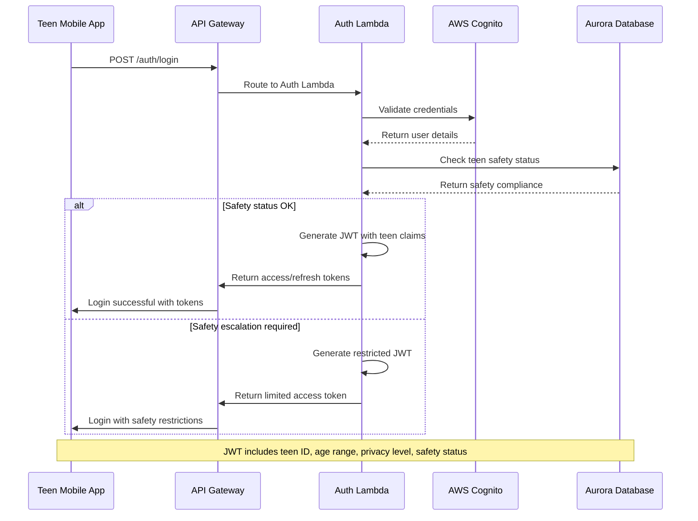

# Amicly Fullstack Architecture Document

This document outlines the complete fullstack architecture for **Amicly**, including backend systems, frontend implementation, and their integration. It serves as the single source of truth for AI-driven development, ensuring consistency across the entire technology stack.

This unified approach combines what would traditionally be separate backend and frontend architecture documents, streamlining the development process for modern fullstack applications where these concerns are increasingly intertwined.

## Starter Template or Existing Project

Based on the PRD analysis, I've identified that **Amicly extends the existing ReferenceApp-Expo foundation**:

**Existing Foundation:** ReferenceApp-Expo React Native application with:
- Proven six-theme design system (#FF4D67 primary color, Urbanist typography, Z-component library)
- Redux-managed theme switching with 3 light + 3 dark theme variations
- Responsive scaling functions with moderateScale
- Monorepo structure already established
- Storybook integration for component development

**Architectural Constraints from ReferenceApp-Expo:**
- React Native 0.81.4+ with Expo SDK ~54.0.10 must be maintained
- Z-component library (ZButton, ZInput, ZText) with proven type system should be extended, not replaced
- Six-theme architecture (Classic Light, Ocean Breeze, Golden Hour, Classic Dark, Midnight Blue, Royal Purple)
- Existing state management patterns should be leveraged
- 85% code reuse target for future iOS deployment
- Performance optimization patterns already proven
- Theme selector interface with live preview functionality

**Modification Scope:** We can add new microservices for AI conversation, safety monitoring, and parent dashboard while maintaining the core mobile app foundation.

### Change Log
| Date | Version | Description | Author |
|------|---------|-------------|---------|
| 2025-09-28 | v1.0 | Initial fullstack architecture creation | Winston (Architect) |

## High Level Architecture

### Technical Summary

Amicly employs a **hybrid serverless microservices architecture** extending the proven ReferenceApp-Expo React Native foundation with dedicated AI conversation services. The frontend maintains conversation-first UX through the existing Z-component library with six-theme support while new backend microservices handle AI processing, safety monitoring, and family dashboard functionality. **AWS platform** provides enterprise-grade safety compliance and scalability for AI workloads, with API Gateway orchestrating communication between the React Native app and specialized Lambda functions. This architecture achieves PRD goals by ensuring <3 second AI response times, 99.5% safety compliance, and COPPA-compliant family privacy controls while maintaining the proven mobile experience foundation with sophisticated theming capabilities.

### Platform and Infrastructure Choice

**Platform:** AWS
**Key Services:** Lambda, API Gateway, Cognito, RDS Aurora Serverless, S3, Bedrock, Comprehend, CloudWatch
**Deployment Host and Regions:** US-East-1 (primary), US-West-2 (DR), with edge locations via CloudFront

### Repository Structure

**Structure:** Monorepo extending existing ReferenceApp-Expo foundation
**Monorepo Tool:** Continuing with existing ReferenceApp-Expo tooling (likely npm workspaces or Lerna)
**Package Organization:**
- `apps/mobile` - Extended ReferenceApp-Expo React Native app with six-theme architecture
- `apps/parent-dashboard` - Next.js web app for parents
- `services/ai-conversation` - Lambda-based AI processing service
- `services/safety-pipeline` - Content moderation and crisis detection
- `packages/shared` - Shared types, utilities, and Z-component extensions
- `packages/referenceapp-z-extended` - Extended ReferenceApp Z-component library

### High Level Architecture Diagram


### Architectural Patterns

- **Serverless Microservices:** Individual Lambda functions for AI conversation, safety monitoring, and family management - _Rationale:_ Enables independent scaling and deployment while maintaining cost efficiency for variable AI workloads

- **API Gateway Pattern:** Single entry point with request routing and rate limiting - _Rationale:_ Centralizes authentication, provides DDoS protection, and enables monitoring of all teen interactions for safety compliance

- **Event-Driven Safety Pipeline:** Asynchronous processing of conversation content for crisis detection - _Rationale:_ Ensures safety monitoring doesn't impact conversation response times while maintaining comprehensive coverage

- **CQRS for Conversation Data:** Separate read/write models for conversation storage and retrieval - _Rationale:_ Optimizes for both real-time conversation flow and complex family privacy query patterns

- **Circuit Breaker for AI Services:** Graceful degradation when AI services are unavailable - _Rationale:_ Maintains app functionality during AI service outages with cached responses and offline conversation history

- **Progressive Web App for Parent Dashboard:** Web-based parent interface with mobile-responsive design - _Rationale:_ Avoids app store approval complexities while providing rich parent experience across devices

## Tech Stack

| Category | Technology | Version | Purpose | Rationale |
|----------|------------|---------|---------|-----------|
| Frontend Language | TypeScript | ~5.9.2 | Type-safe mobile development | Extends ReferenceApp-Expo foundation, ensures safety in teen-facing code |
| Frontend Framework | React Native + Expo | 0.81.4 / ~54.0.10 | Cross-platform mobile app | Maintains existing ReferenceApp-Expo investment, 85% iOS code reuse target |
| UI Component Library | ReferenceApp-Expo Z-Components | Current | Six-theme proven design system | Leverages #FF4D67 brand, Urbanist fonts, battle-tested performance with 6 theme variations |
| State Management | Redux Toolkit + RTK Query | ^2.9.0 | Predictable state with caching | Extends existing ReferenceApp-Expo patterns, handles AI conversation state |
| Navigation | React Navigation v6 | ^7.1.17 | Navigation management | De facto standard for React Native navigation from ReferenceApp |
| Design System Tool | Storybook | ^9.1.4 | Component development | Isolated component development and testing from ReferenceApp patterns |
| Vector Graphics | React Native SVG | 15.12.1 | Scalable graphics | High-quality icons and illustrations |
| Icon Library | React Native Vector Icons | ^10.3.0 | Icon system | Comprehensive icon library from ReferenceApp |
| Font Management | Expo Font | Built-in | Custom typography | Urbanist font family integration (Regular, Medium, SemiBold, Bold) |
| Backend Language | TypeScript | 5.x | Unified language across stack | Shared types between frontend/backend, team efficiency |
| Backend Framework | AWS Lambda + Serverless Framework | 3.x | Serverless microservices | Auto-scaling for AI workloads, cost efficiency, AWS ecosystem |
| API Style | REST + WebSocket | OpenAPI 3.0 | HTTP APIs + real-time chat | Proven mobile compatibility, real-time conversation support |
| Database | AWS RDS Aurora Serverless v2 | PostgreSQL 14+ | Scalable relational storage | ACID compliance for financial/safety data, auto-scaling |
| Cache | AWS ElastiCache Redis | 7.x | Session and conversation caching | Sub-second conversation history, AI response caching |
| File Storage | AWS S3 + CloudFront | Current | Voice recordings and assets | Secure teen voice data, global CDN for performance |
| Authentication | AWS Cognito + Custom Lambda | Current | Multi-factor family auth | COPPA compliance, age-graduated controls, family linking |
| Frontend Testing | Jest + React Native Testing Library | 29.x | Component and integration tests | Extends ReferenceApp-Expo testing patterns, conversation flow testing |
| Backend Testing | Jest + Supertest | 29.x | API and Lambda function tests | TypeScript compatibility, AWS Lambda testing support |
| E2E Testing | Detox + AWS Device Farm | 20.x | Real device testing | React Native native support, teen device compatibility testing |
| Build Tool | Expo CLI + EAS Build | Latest | Mobile app compilation | Maintains ReferenceApp-Expo build pipeline, cross-platform support |
| Bundler | Metro (React Native) + Webpack | Current | Mobile and web bundling | React Native default, parent dashboard web bundling |
| IaC Tool | AWS CDK | 2.x | Infrastructure as Code | TypeScript-based infrastructure, version control for compliance |
| CI/CD | GitHub Actions + AWS CodePipeline | Current | Automated deployment | Multi-environment safety testing, compliance audit trails |
| Monitoring | AWS CloudWatch + X-Ray | Current | Application performance monitoring | AI conversation latency tracking, safety incident monitoring |
| Logging | AWS CloudWatch Logs + Structured Logging | Current | Centralized log management | COPPA-compliant log retention, safety audit requirements |
| CSS Framework | Styled Components + ReferenceApp-Expo Theming | 5.x | Component styling | Maintains existing six-theme design system, conversation-specific styling |
| Package Manager | Yarn | Latest | Dependency management | Fast and reliable package management from ReferenceApp |
| Code Quality | Metro | ^0.77.0 | Bundle optimization | React Native specific bundler |

---

## Six-Theme Color System (ReferenceApp Foundation)

### Six-Theme Architecture

The project implements ReferenceApp's sophisticated 6-theme system with 3 light and 3 dark variations, allowing users to personalize their experience through an intuitive theme selector interface.

### Primary Color Palette

```javascript
// Primary Brand Colors (shared across all themes)
const commonColor = {
  white: '#FFFFFF',
  black: '#000000',
  primary: '#FF4D67',        // Main brand color (pink/red)
  primaryTransparent: '#FF4D6714', // 14% opacity primary
  lightRed: '#FF5C74',       // Lighter variant
  redColor: '#F75555',       // Error states
  orange: '#FB9400',         // Warning/accent
  blue: '#7210FF',           // Info/secondary actions
  yellow: '#FFD300',         // Highlights
  grayScale1: '#F5F5F5',     // Lightest gray
  grayScale3: '#E0E0E0',     // Light gray
  grayScale4: '#BDBDBD',     // Medium light gray
  grayScale5: '#9E9E9E',     // Medium gray
  grayScale7: '#616161',     // Dark gray
}
```

### Complete Theme Implementations

```javascript
// === LIGHT THEMES ===

// 1. Classic Light Theme
const LightColor = {
  light: 'light',
  backgroundColor: '#FFFFFF',
  textColor: '#212121',
  textRevertColor: '#FFFFFF',
  btnColor3: '#EEEEEE',
  inputBg: '#FAFAFA',
  dark3: '#FFEDF0',
  iconColor: '#9E9E9E',
  bColor: '#EEEEEE',
  btnColor1: '#FFFFFF',
}

// 2. Ocean Breeze (Light Blue)
const LightBlueColor = {
  lightBlue: 'lightBlue',
  backgroundColor: '#F8FAFF',
  textColor: '#1A1F36',
  textRevertColor: '#FFFFFF',
  btnColor3: '#E8F1FF',
  inputBg: '#F0F6FF',
  dark3: '#E3F2FD',
  iconColor: '#7B8BB2',
  bColor: '#E0EFFF',
  btnColor1: '#F8FAFF',
}

// 3. Golden Hour (Light Warm)
const LightWarmColor = {
  lightWarm: 'lightWarm',
  backgroundColor: '#FFFBF7',
  textColor: '#2D1B0E',
  textRevertColor: '#FFFFFF',
  btnColor3: '#FFF2E6',
  inputBg: '#FEF8F2',
  dark3: '#FFF0E6',
  iconColor: '#B8956A',
  bColor: '#FFEAD6',
  btnColor1: '#FFFBF7',
}

// === DARK THEMES ===

// 4. Classic Dark Theme
const DarkColor = {
  dark: 'dark',
  backgroundColor: '#181A20',
  textColor: '#FFFFFF',
  textRevertColor: '#212121',
  btnColor3: '#1F222A',
  inputBg: '#1F222A',
  dark3: '#35383F',
  iconColor: '#616161',
  bColor: '#35383F',
  btnColor1: '#1F222A',
}

// 5. Midnight Blue (Dark Blue)
const DarkBlueColor = {
  darkBlue: 'darkBlue',
  backgroundColor: '#0F1419',
  textColor: '#E8F4FF',
  textRevertColor: '#0F1419',
  btnColor3: '#1A2332',
  inputBg: '#162029',
  dark3: '#243447',
  iconColor: '#5A6B7D',
  bColor: '#243447',
  btnColor1: '#1A2332',
}

// 6. Royal Purple (Dark Purple)
const DarkPurpleColor = {
  darkPurple: 'darkPurple',
  backgroundColor: '#1A0F1F',
  textColor: '#F5F0FF',
  textRevertColor: '#1A0F1F',
  btnColor3: '#2D1B35',
  inputBg: '#251A2E',
  dark3: '#3D2A47',
  iconColor: '#8B7A9B',
  bColor: '#3D2A47',
  btnColor1: '#2D1B35',
}

// Export all themes with common colors
export const colors = {
  light: { ...LightColor, ...commonColor },
  lightBlue: { ...LightBlueColor, ...commonColor },
  lightWarm: { ...LightWarmColor, ...commonColor },
  dark: { ...DarkColor, ...commonColor },
  darkBlue: { ...DarkBlueColor, ...commonColor },
  darkPurple: { ...DarkPurpleColor, ...commonColor },
}
```

### Typography System (Urbanist Font Family)

```javascript
// Font Family Configuration
const fontWeights = {
  Regular: { fontFamily: 'Urbanist-Regular' },
  Medium: { fontFamily: 'Urbanist-Medium' },
  SemiBold: { fontFamily: 'Urbanist-SemiBold' },
  Bold: { fontFamily: 'Urbanist-Bold' },
}

// Font Size Scale (using moderateScale for responsive sizing)
const fontSizes = {
  f12: { fontSize: moderateScale(12) },
  f14: { fontSize: moderateScale(14) },
  f16: { fontSize: moderateScale(16) },
  f18: { fontSize: moderateScale(18) },
  f20: { fontSize: moderateScale(20) },
  f24: { fontSize: moderateScale(24) },
  f28: { fontSize: moderateScale(28) },
  f32: { fontSize: moderateScale(32) },
  f36: { fontSize: moderateScale(36) },
  f40: { fontSize: moderateScale(40) },
}
```

## Component Architecture (ReferenceApp Z-Components)

### Custom Component System

The project uses ReferenceApp's sophisticated custom component library with consistent theming:

#### ZText Component Pattern
```typescript
// Intelligent text component with automatic theme integration
<ZText
  type="B18"           // Bold 18px
  color={colors.primary}
  align="center"
>
  {content}
</ZText>

// Type format: [Weight][Size]
// Weights: R(Regular), M(Medium), S(SemiBold), B(Bold)
// Sizes: 12, 14, 16, 18, 20, 22, 24, 26, 28, 30, 32, 34, 36, 40, 46
```

#### ZButton Component Pattern
```typescript
// Themed button with consistent styling
<ZButton
  title="Continue"
  textType="B16"
  onPress={handlePress}
  bgColor={colors.primary}
  frontIcon={<Icon />}
/>
```

### Theme Selector System

The project includes ReferenceApp's sophisticated theme selector that allows users to choose from 6 curated themes with live preview functionality.

#### Theme Selector Features
- **Visual theme cards** with live color previews
- **Organized sections** (Light Themes / Dark Themes)
- **Selected theme indicators** with badges
- **Automatic persistence** to AsyncStorage
- **Immediate application** across entire app

#### Theme Names and Descriptions

| Theme ID | Display Name | Description | Best For |
|----------|-------------|-------------|----------|
| `light` | Classic Light | Clean and bright | General use, readability |
| `lightBlue` | Ocean Breeze | Cool blue tones | Calming, professional |
| `lightWarm` | Golden Hour | Warm and cozy | Comfortable reading |
| `dark` | Classic Dark | Sleek and modern | Night use, battery saving |
| `darkBlue` | Midnight Blue | Deep ocean vibes | Sophisticated, elegant |
| `darkPurple` | Royal Purple | Luxurious darkness | Creative, artistic |

## Development Environment Setup (amicaenv - Project-Isolated Environment)

### Prerequisites (Global - One-Time Setup)
```bash
# Install Node.js (v18 or later) via Node Version Manager
curl -o- https://raw.githubusercontent.com/nvm-sh/nvm/v0.39.0/install.sh | bash
nvm install 18.19.0
nvm use 18.19.0

# Install Yarn package manager globally (only global dependency)
npm install -g yarn

# Optional: Install direnv for automatic environment activation
# macOS: brew install direnv
# Ubuntu: apt install direnv
```

### amicaenv Project Environment Setup
```bash
# Clone and enter project
git clone <amicly-repo>
cd amicly

# Activate amicaenv (project-isolated environment)
./scripts/amicaenv-activate.sh

# Or use direnv (automatic activation when entering directory)
echo "use node 18.19.0" > .envrc
echo 'export PATH="./node_modules/.bin:$PATH"' >> .envrc
echo 'export PROJECT_ENV="amicaenv"' >> .envrc
direnv allow

# Install all dependencies (including dev tools locally)
yarn install
```

### amicaenv Dependencies (Local to Project)
```json
// package.json devDependencies
{
  "devDependencies": {
    "@expo/cli": "^0.17.0",
    "eas-cli": "^5.8.0",
    "@aws-cdk/cli": "^2.x",
    "serverless": "^3.x",
    "@storybook/cli": "^9.1.4",
    "aws-cli-js": "^2.x",
    "typescript": "~5.9.2",
    "jest": "^29.x"
  },
  "scripts": {
    "env:activate": "./scripts/amicaenv-activate.sh",
    "env:status": "echo $PROJECT_ENV && node --version && yarn --version",
    "expo": "expo",
    "eas": "eas",
    "cdk": "cdk",
    "sls": "serverless",
    "storybook": "storybook"
  }
}
```

### amicaenv Benefits
- **Version Isolation**: Project-specific tool versions prevent conflicts
- **Reproducible Environment**: Exact same tools across all developer machines
- **Fast Setup**: Single command activation with all dependencies
- **CI/CD Compatibility**: Same environment for local development and build pipelines
- **Minimal Global Dependencies**: Only Node.js and Yarn required globally
- **Team Consistency**: Standardized toolchain across entire development team

### amicaenv Development Commands
```bash
# Verify environment is active
yarn env:status  # Should show: amicaenv, Node 18.x, Yarn version

# Mobile Development
yarn expo start                    # Start Expo development server
yarn expo start --clear           # Start with cache cleared
yarn expo start --ios             # Start for iOS
yarn expo start --android         # Start for Android

# Component Development
yarn storybook dev                 # Start Storybook for component development
yarn storybook build              # Build Storybook for production

# Backend Development
yarn sls offline                   # Start serverless functions locally
yarn cdk deploy --profile dev      # Deploy infrastructure to dev environment

# AWS Tools (local versions)
yarn eas build --platform ios     # Build iOS app
yarn eas submit --platform ios    # Submit to App Store

# Database
yarn db:start                      # Start local PostgreSQL
yarn db:migrate                    # Run database migrations
yarn db:seed                       # Seed with test data
```

### Project Structure for Implementation (ReferenceApp Pattern)

```
amicly/
├── apps/
│   ├── mobile/                # React Native app (extended ReferenceApp)
│   │   ├── src/
│   │   │   ├── assets/
│   │   │   │   ├── fonts/
│   │   │   │   │   ├── Urbanist-Regular.ttf
│   │   │   │   │   ├── Urbanist-Medium.ttf
│   │   │   │   │   ├── Urbanist-SemiBold.ttf
│   │   │   │   │   └── Urbanist-Bold.ttf
│   │   │   │   ├── images/
│   │   │   │   └── svgs/
│   │   │   ├── components/
│   │   │   │   ├── common/
│   │   │   │   │   ├── ZText.tsx
│   │   │   │   │   ├── ZButton.tsx
│   │   │   │   │   ├── ZHeader.tsx
│   │   │   │   │   └── ZSafeAreaView.tsx
│   │   │   │   └── models/          # Modal components
│   │   │   ├── containers/
│   │   │   │   ├── auth/           # Authentication screens
│   │   │   │   ├── TabBar/         # Main tab navigation screens
│   │   │   │   │   └── profile/    # Theme selector location
│   │   │   │   └── OnBoarding.tsx
│   │   │   ├── navigation/
│   │   │   │   ├── Type/
│   │   │   │   │   ├── StackNavigation.tsx
│   │   │   │   │   └── TabBarNavigation.tsx
│   │   │   │   ├── NavigationKeys.ts
│   │   │   │   └── index.ts
│   │   │   ├── redux/
│   │   │   │   ├── action/
│   │   │   │   ├── reducer/
│   │   │   │   ├── store/
│   │   │   │   └── types/
│   │   │   ├── themes/
│   │   │   │   ├── colors.ts
│   │   │   │   ├── typography.ts
│   │   │   │   ├── commonStyle.ts
│   │   │   │   ├── flex.ts
│   │   │   │   ├── margin.ts
│   │   │   │   ├── padding.ts
│   │   │   │   └── index.ts
│   │   │   ├── utils/
│   │   │   │   ├── helpers.ts
│   │   │   │   └── validators.ts
│   │   │   ├── common/
│   │   │   │   └── constants.ts
│   │   │   └── index.ts
│   │   ├── .rnstorybook/           # Storybook configuration
│   │   ├── App.tsx                 # Main app with Storybook integration
│   │   ├── app.json               # Expo configuration
│   │   └── package.json
│   └── parent-dashboard/           # Next.js web app
├── services/                      # Lambda microservices
├── packages/
│   ├── shared/                    # Shared types and utilities
│   └── referenceapp-z-extended/   # Extended Z-component library
└── infrastructure/                # AWS CDK
```

### Environment Configuration

#### Required Environment Variables
```bash
# Expo Configuration
EXPO_PUBLIC_STORYBOOK=false  # Enable/disable Storybook mode

# App Configuration
APP_NAME=Amicly
APP_VERSION=1.0.0
```

#### Expo Configuration (app.json)
```json
{
  "expo": {
    "name": "Amicly",
    "slug": "amicly",
    "version": "1.0.0",
    "orientation": "portrait",
    "userInterfaceStyle": "light",
    "plugins": [
      ["expo-font", {
        "fonts": [
          "./src/assets/fonts/Urbanist-Bold.ttf",
          "./src/assets/fonts/Urbanist-Regular.ttf",
          "./src/assets/fonts/Urbanist-SemiBold.ttf",
          "./src/assets/fonts/Urbanist-Medium.ttf"
        ]
      }]
    ]
  }
}
```

## Template Implementation Examples (ReferenceApp Patterns)

### ZText Component Template
```typescript
import React from 'react';
import {Text} from 'react-native';
import {useSelector} from 'react-redux';
import Typography from '../../themes/typography';

const ZText = ({type, style, align, color, children, ...props}) => {
  const colors = useSelector(state => state.theme.theme);

  const fontWeights = () => {
    switch (type.charAt(0).toUpperCase()) {
      case 'R': return Typography.fontWeights.Regular;
      case 'M': return Typography.fontWeights.Medium;
      case 'S': return Typography.fontWeights.SemiBold;
      case 'B': return Typography.fontWeights.Bold;
      default: return Typography.fontWeights.Regular;
    }
  };

  const fontSize = () => {
    const size = type.slice(1);
    return Typography.fontSizes[`f${size}`] || Typography.fontSizes.f14;
  };

  return (
    <Text
      style={[
        type && {...fontWeights(), ...fontSize()},
        {color: color ? color : colors.textColor},
        align && {textAlign: align},
        style,
      ]}
      {...props}>
      {children}
    </Text>
  );
};

export default React.memo(ZText);
```

### Theme State Management Template
```typescript
// Theme reducer with support for all 6 themes
const getThemeByType = (themeType) => {
  switch (themeType) {
    case 'light': return colors.light;
    case 'lightBlue': return colors.lightBlue;
    case 'lightWarm': return colors.lightWarm;
    case 'dark': return colors.dark;
    case 'darkBlue': return colors.darkBlue;
    case 'darkPurple': return colors.darkPurple;
    default: return colors.light;
  }
};

// Theme action with AsyncStorage persistence
export const setThemeColor = (themeType) => {
  return async dispatch => {
    try {
      await AsyncStorage.setItem(THEME, themeType);
      dispatch({ type: CHANGE_THEME, payload: themeType });
    } catch (error) {
      console.log('Error saving theme:', error);
    }
  };
};
```

### Component with Theme Support Template
```typescript
// Example: Creating a new themed component
import {useSelector} from 'react-redux';
import {colors} from '../themes/colors';

const ConversationBubble = ({ message, isFromAI }) => {
  const currentTheme = useSelector(state => state.theme.theme);
  const themeType = useSelector(state => state.theme.themeType);

  // Check if it's a dark theme
  const isDarkTheme = ['dark', 'darkBlue', 'darkPurple'].includes(themeType);

  return (
    <View style={[
      styles.container,
      {backgroundColor: isFromAI
        ? currentTheme.btnColor3
        : currentTheme.primary
      }
    ]}>
      <ZText
        type="R16"
        color={isFromAI ? currentTheme.textColor : currentTheme.textRevertColor}
      >
        {message}
      </ZText>
    </View>
  );
};
```

### Theme Selector Implementation Template
```typescript
// Theme options configuration
const themeOptions = [
  {
    id: 'light',
    name: 'Classic Light',
    description: 'Clean and bright',
    theme: colors.light,
    category: 'light'
  },
  {
    id: 'lightBlue',
    name: 'Ocean Breeze',
    description: 'Cool blue tones',
    theme: colors.lightBlue,
    category: 'light'
  },
  {
    id: 'lightWarm',
    name: 'Golden Hour',
    description: 'Warm and cozy',
    theme: colors.lightWarm,
    category: 'light'
  },
  {
    id: 'dark',
    name: 'Classic Dark',
    description: 'Sleek and modern',
    theme: colors.dark,
    category: 'dark'
  },
  {
    id: 'darkBlue',
    name: 'Midnight Blue',
    description: 'Deep ocean vibes',
    theme: colors.darkBlue,
    category: 'dark'
  },
  {
    id: 'darkPurple',
    name: 'Royal Purple',
    description: 'Luxurious darkness',
    theme: colors.darkPurple,
    category: 'dark'
  }
];

// Theme selection handler
const handleThemeSelect = (themeKey) => {
  dispatch(setThemeColor(themeKey));
};
```

## Data Models

### TeenUser

**Purpose:** Represents the primary teen user with age-graduated privacy controls and safety monitoring capabilities

**Key Attributes:**
- `id`: string - Unique user identifier (UUID)
- `username`: string - Display name chosen by teen
- `email`: string - Optional for account recovery (age-dependent)
- `ageRange`: enum - 13-14, 15-16, 17-18 (for privacy graduation)
- `birthYear`: number - Year only for COPPA compliance
- `privacyLevel`: enum - guided, balanced, autonomous (auto-set by age)
- `parentConsent`: boolean - Required for under-13 users
- `safetyStatus`: enum - active, monitoring, escalated, resolved
- `createdAt`: timestamp - Account creation
- `lastActiveAt`: timestamp - Session tracking

#### TypeScript Interface
```typescript
interface TeenUser {
  id: string;
  username: string;
  email?: string;
  ageRange: '13-14' | '15-16' | '17-18';
  birthYear: number;
  privacyLevel: 'guided' | 'balanced' | 'autonomous';
  parentConsent: boolean;
  safetyStatus: 'active' | 'monitoring' | 'escalated' | 'resolved';
  familyId?: string;
  encryptionKeyId: string;
  createdAt: Date;
  lastActiveAt: Date;
  preferences: UserPreferences;
}

interface UserPreferences {
  voiceEnabled: boolean;
  parentSharingTopics: string[];
  memoryRetentionDays: number;
  crisisContactPreferences: CrisisContact[];
}
```

#### Relationships
- Has one Family (optional for single-user accounts)
- Has many Conversations
- Has many SafetyIncidents
- Has one AIPersonality configuration

### Conversation

**Purpose:** Stores encrypted conversation threads with user-controlled retention and family sharing permissions

**Key Attributes:**
- `id`: string - Unique conversation identifier
- `teenUserId`: string - Owner of the conversation
- `title`: string - Auto-generated or user-defined thread title
- `encryptedContent`: blob - E2E encrypted conversation data
- `emotionalTone`: enum - supportive, neutral, concerned, celebratory
- `containsSensitiveContent`: boolean - Flagged for privacy review
- `parentSharable`: boolean - Teen-controlled sharing permission
- `retentionDate`: timestamp - Auto-deletion date
- `safetyScore`: number - 0-100 content safety rating
- `topicTags`: string[] - AI-generated conversation categories

#### TypeScript Interface
```typescript
interface Conversation {
  id: string;
  teenUserId: string;
  title: string;
  encryptedContent: Buffer;
  emotionalTone: 'supportive' | 'neutral' | 'concerned' | 'celebratory';
  containsSensitiveContent: boolean;
  parentSharable: boolean;
  retentionDate: Date;
  safetyScore: number;
  topicTags: string[];
  messageCount: number;
  createdAt: Date;
  updatedAt: Date;
  lastMessageAt: Date;
}

interface ConversationMessage {
  id: string;
  conversationId: string;
  sender: 'teen' | 'ai';
  content: string;
  messageType: 'text' | 'voice' | 'system';
  voiceFileUrl?: string;
  safetyFlags: string[];
  timestamp: Date;
}
```

#### Relationships
- Belongs to one TeenUser
- Has many ConversationMessages
- May trigger SafetyIncidents
- References AIPersonality for response generation

### Family

**Purpose:** Links teen and parent accounts with age-appropriate oversight and communication channels

**Key Attributes:**
- `id`: string - Unique family identifier
- `familyName`: string - Display name for family unit
- `primaryParentId`: string - Main parent/guardian account
- `teenIds`: string[] - Array of teen user IDs in family
- `privacyAgreement`: object - Agreed-upon family privacy rules
- `communicationPreferences`: object - How/when parents receive updates
- `emergencyContacts`: array - Crisis escalation contact information
- `subscriptionTier`: enum - free, premium, family_plus

#### TypeScript Interface
```typescript
interface Family {
  id: string;
  familyName: string;
  primaryParentId: string;
  secondaryParentIds: string[];
  teenIds: string[];
  privacyAgreement: FamilyPrivacyAgreement;
  communicationPreferences: CommunicationSettings;
  emergencyContacts: EmergencyContact[];
  subscriptionTier: 'free' | 'premium' | 'family_plus';
  createdAt: Date;
  updatedAt: Date;
}

interface FamilyPrivacyAgreement {
  allowedTopics: string[];
  restrictedTopics: string[];
  notificationSettings: NotificationPreferences;
  graduationRules: PrivacyGraduationRules;
}
```

#### Relationships
- Has one primary ParentUser
- Has many TeenUsers
- Has many FamilyProgressReports
- References SubscriptionPlans

### SafetyIncident

**Purpose:** Tracks and manages crisis detection, content moderation, and safety escalations with audit trail

**Key Attributes:**
- `id`: string - Unique incident identifier
- `teenUserId`: string - Teen involved in incident
- `incidentType`: enum - crisis_detection, inappropriate_content, manual_report
- `severityLevel`: enum - low, moderate, high, emergency
- `triggerContent`: string - Content that triggered incident (encrypted)
- `aiConfidence`: number - ML model confidence in detection
- `humanReviewed`: boolean - Whether human moderator reviewed
- `escalationActions`: array - Actions taken (parent notify, professional contact, etc.)
- `resolutionStatus`: enum - open, investigating, resolved, false_positive
- `followUpRequired`: boolean - Whether ongoing monitoring needed

#### TypeScript Interface
```typescript
interface SafetyIncident {
  id: string;
  teenUserId: string;
  conversationId?: string;
  incidentType: 'crisis_detection' | 'inappropriate_content' | 'manual_report';
  severityLevel: 'low' | 'moderate' | 'high' | 'emergency';
  triggerContent: string; // encrypted
  aiConfidence: number;
  humanReviewed: boolean;
  reviewedBy?: string;
  escalationActions: EscalationAction[];
  resolutionStatus: 'open' | 'investigating' | 'resolved' | 'false_positive';
  followUpRequired: boolean;
  createdAt: Date;
  resolvedAt?: Date;
  notes: string;
}

interface EscalationAction {
  actionType: 'parent_notify' | 'professional_contact' | 'emergency_services';
  status: 'pending' | 'completed' | 'failed';
  timestamp: Date;
  details: Record<string, any>;
}
```

#### Relationships
- Belongs to one TeenUser
- May reference one Conversation
- Links to Family for parent notifications
- Creates AuditLogEntries for compliance

### AIPersonality

**Purpose:** Configures AI conversation behavior, emotional intelligence, and life coaching integration for each teen

**Key Attributes:**
- `id`: string - Unique personality configuration ID
- `teenUserId`: string - Associated teen user
- `personalityTraits`: object - AI behavioral characteristics
- `communicationStyle`: enum - casual, formal, supportive, coaching
- `lifeCachingFocus`: array - Areas of guidance (academic, social, emotional)
- `conversationMemory`: object - Learned patterns and preferences
- `restrictedTopics`: array - Parent or safety-configured topic limits
- `responsePatterns`: object - Customized AI response templates

#### TypeScript Interface
```typescript
interface AIPersonality {
  id: string;
  teenUserId: string;
  personalityTraits: PersonalityTraits;
  communicationStyle: 'casual' | 'formal' | 'supportive' | 'coaching';
  lifeCachingFocus: LifeCoachingArea[];
  conversationMemory: ConversationMemory;
  restrictedTopics: string[];
  responsePatterns: ResponsePattern[];
  lastUpdated: Date;
  version: string;
}

interface PersonalityTraits {
  empathy: number; // 1-10 scale
  humor: number;
  directness: number;
  supportiveness: number;
  challengeLevel: number;
}

type LifeCoachingArea = 'academic' | 'social' | 'emotional' | 'health' | 'career' | 'family';
```

#### Relationships
- Belongs to one TeenUser
- Influences Conversation generation
- References LifeCoachingTemplates
- Updates based on ConversationFeedback

## API Specification

```yaml
openapi: 3.0.0
info:
  title: Amicly AI Companion API
  version: 1.0.0
  description: REST API for Amicly teen AI companion with family integration and safety-first design
servers:
  - url: https://api.amicly.com/v1
    description: Production API
  - url: https://staging-api.amicly.com/v1
    description: Staging environment

paths:
  # Authentication Endpoints
  /auth/register:
    post:
      summary: Register new teen user with age verification
      requestBody:
        required: true
        content:
          application/json:
            schema:
              type: object
              properties:
                username:
                  type: string
                  minLength: 3
                birthYear:
                  type: integer
                  minimum: 2005
                email:
                  type: string
                  format: email
                parentEmail:
                  type: string
                  format: email
                  description: Required for users under 16
      responses:
        '201':
          description: User successfully registered
        '400':
          description: Invalid registration data or age verification failed

  /auth/login:
    post:
      summary: Authenticate teen user
      requestBody:
        required: true
        content:
          application/json:
            schema:
              type: object
              properties:
                username:
                  type: string
                password:
                  type: string
      responses:
        '200':
          description: Authentication successful
          content:
            application/json:
              schema:
                type: object
                properties:
                  accessToken:
                    type: string
                  refreshToken:
                    type: string
                  user:
                    $ref: '#/components/schemas/TeenUser'

  # Conversation Endpoints
  /conversations:
    get:
      summary: Get conversation history for authenticated teen
      security:
        - BearerAuth: []
      parameters:
        - name: limit
          in: query
          schema:
            type: integer
            default: 20
        - name: before
          in: query
          schema:
            type: string
            format: date-time
      responses:
        '200':
          description: Conversation list retrieved
          content:
            application/json:
              schema:
                type: object
                properties:
                  conversations:
                    type: array
                    items:
                      $ref: '#/components/schemas/Conversation'
                  hasMore:
                    type: boolean

    post:
      summary: Start new conversation thread
      security:
        - BearerAuth: []
      requestBody:
        required: true
        content:
          application/json:
            schema:
              type: object
              properties:
                initialMessage:
                  type: string
                conversationType:
                  type: string
                  enum: [text, voice]
      responses:
        '201':
          description: New conversation created
          content:
            application/json:
              schema:
                $ref: '#/components/schemas/Conversation'

  /conversations/{conversationId}/messages:
    post:
      summary: Send message to AI companion
      security:
        - BearerAuth: []
      parameters:
        - name: conversationId
          in: path
          required: true
          schema:
            type: string
      requestBody:
        required: true
        content:
          application/json:
            schema:
              type: object
              properties:
                content:
                  type: string
                messageType:
                  type: string
                  enum: [text, voice]
                voiceFileUrl:
                  type: string
                  format: uri
      responses:
        '201':
          description: Message processed and AI response generated
          content:
            application/json:
              schema:
                type: object
                properties:
                  userMessage:
                    $ref: '#/components/schemas/ConversationMessage'
                  aiResponse:
                    $ref: '#/components/schemas/ConversationMessage'
                  safetyCheck:
                    $ref: '#/components/schemas/SafetyCheckResult'

  # Voice Processing Endpoints
  /voice/upload:
    post:
      summary: Upload voice recording for transcription
      security:
        - BearerAuth: []
      requestBody:
        required: true
        content:
          multipart/form-data:
            schema:
              type: object
              properties:
                audioFile:
                  type: string
                  format: binary
                conversationId:
                  type: string
      responses:
        '200':
          description: Voice processed and transcribed
          content:
            application/json:
              schema:
                type: object
                properties:
                  transcription:
                    type: string
                  confidence:
                    type: number
                  voiceFileUrl:
                    type: string

  /voice/synthesize:
    post:
      summary: Convert AI text response to speech
      security:
        - BearerAuth: []
      requestBody:
        required: true
        content:
          application/json:
            schema:
              type: object
              properties:
                text:
                  type: string
                voicePersonality:
                  type: string
                  enum: [supportive, casual, coaching]
      responses:
        '200':
          description: Text synthesized to speech
          content:
            application/json:
              schema:
                type: object
                properties:
                  audioUrl:
                    type: string
                  duration:
                    type: number

  # Privacy Control Endpoints
  /privacy/settings:
    get:
      summary: Get teen's current privacy settings
      security:
        - BearerAuth: []
      responses:
        '200':
          description: Privacy settings retrieved
          content:
            application/json:
              schema:
                $ref: '#/components/schemas/PrivacySettings'

    put:
      summary: Update privacy settings (age-appropriate controls)
      security:
        - BearerAuth: []
      requestBody:
        required: true
        content:
          application/json:
            schema:
              $ref: '#/components/schemas/PrivacySettings'
      responses:
        '200':
          description: Privacy settings updated
        '403':
          description: Action not allowed for current age group

  # Safety and Crisis Endpoints
  /safety/report:
    post:
      summary: Report safety concern or request help
      security:
        - BearerAuth: []
      requestBody:
        required: true
        content:
          application/json:
            schema:
              type: object
              properties:
                reportType:
                  type: string
                  enum: [crisis, inappropriate_content, technical_issue]
                description:
                  type: string
                urgency:
                  type: string
                  enum: [low, medium, high, emergency]
      responses:
        '201':
          description: Safety report submitted
          content:
            application/json:
              schema:
                $ref: '#/components/schemas/SafetyIncident'

  # Family Integration Endpoints (Parent Dashboard)
  /family/dashboard:
    get:
      summary: Get family dashboard data for parent
      security:
        - BearerAuth: []
      responses:
        '200':
          description: Dashboard data retrieved
          content:
            application/json:
              schema:
                $ref: '#/components/schemas/FamilyDashboard'

  /family/teens/{teenId}/progress:
    get:
      summary: Get teen's sharable progress data
      security:
        - BearerAuth: []
      parameters:
        - name: teenId
          in: path
          required: true
          schema:
            type: string
      responses:
        '200':
          description: Teen progress data (respecting privacy settings)
          content:
            application/json:
              schema:
                $ref: '#/components/schemas/TeenProgress'

components:
  securitySchemes:
    BearerAuth:
      type: http
      scheme: bearer
      bearerFormat: JWT

  schemas:
    TeenUser:
      type: object
      properties:
        id:
          type: string
        username:
          type: string
        ageRange:
          type: string
          enum: ['13-14', '15-16', '17-18']
        privacyLevel:
          type: string
          enum: [guided, balanced, autonomous]
        createdAt:
          type: string
          format: date-time

    Conversation:
      type: object
      properties:
        id:
          type: string
        title:
          type: string
        emotionalTone:
          type: string
          enum: [supportive, neutral, concerned, celebratory]
        messageCount:
          type: integer
        lastMessageAt:
          type: string
          format: date-time
        parentSharable:
          type: boolean

    ConversationMessage:
      type: object
      properties:
        id:
          type: string
        sender:
          type: string
          enum: [teen, ai]
        content:
          type: string
        messageType:
          type: string
          enum: [text, voice, system]
        timestamp:
          type: string
          format: date-time

    SafetyCheckResult:
      type: object
      properties:
        safetyScore:
          type: number
          minimum: 0
          maximum: 100
        flags:
          type: array
          items:
            type: string
        escalationRequired:
          type: boolean

    PrivacySettings:
      type: object
      properties:
        parentSharingEnabled:
          type: boolean
        sharableTopics:
          type: array
          items:
            type: string
        memoryRetentionDays:
          type: integer
        crisisContactPermissions:
          type: object

    SafetyIncident:
      type: object
      properties:
        id:
          type: string
        incidentType:
          type: string
          enum: [crisis_detection, inappropriate_content, manual_report]
        severityLevel:
          type: string
          enum: [low, moderate, high, emergency]
        status:
          type: string
          enum: [open, investigating, resolved]
        createdAt:
          type: string
          format: date-time

    FamilyDashboard:
      type: object
      properties:
        familyId:
          type: string
        teens:
          type: array
          items:
            $ref: '#/components/schemas/TeenOverview'
        recentActivity:
          type: array
          items:
            $ref: '#/components/schemas/ActivitySummary'

    TeenProgress:
      type: object
      properties:
        teenId:
          type: string
        conversationStats:
          type: object
        emotionalTrends:
          type: object
        achievementMilestones:
          type: array
        lastActive:
          type: string
          format: date-time
```

## Components

### Mobile App Shell (React Native)

**Responsibility:** Core mobile application extending ReferenceApp-Expo foundation, handling conversation UI, voice recording, and teen-facing privacy controls

**Key Interfaces:**
- Conversation API client for real-time messaging
- Voice recording and playback interface
- Privacy control management UI
- Crisis support emergency interface

**Dependencies:** API Gateway, AWS Cognito for auth, Redux store management, ReferenceApp-Expo Z-component library

**Technology Stack:** React Native 0.72+, Expo SDK, TypeScript, Redux Toolkit, existing ReferenceApp-Expo patterns with conversation-specific extensions

### AI Conversation Service (Lambda)

**Responsibility:** Processes teen messages through safety filters, generates contextually appropriate AI responses using teen-safe prompting, and maintains conversation memory

**Key Interfaces:**
- REST API endpoints for message processing
- AWS Bedrock integration for AI model access
- Safety pipeline integration for content moderation
- Conversation encryption/decryption service

**Dependencies:** AWS Bedrock (AI models), Safety Pipeline Service, Aurora PostgreSQL (conversation storage), ElastiCache (response caching)

**Technology Stack:** Node.js Lambda functions, TypeScript, AWS Bedrock SDK, custom safety prompting framework, conversation context management

### Safety Pipeline Service (Lambda)

**Responsibility:** Real-time content analysis, crisis detection using teen-specific patterns, escalation management, and safety incident tracking with human review integration

**Key Interfaces:**
- Content analysis API for incoming messages
- Crisis detection ML model integration
- Parent notification system interface
- Professional resource connection API

**Dependencies:** AWS Comprehend, custom SageMaker models, SNS for notifications, Aurora PostgreSQL for incident tracking

**Technology Stack:** Python Lambda functions for ML processing, AWS Comprehend API, custom crisis detection models, incident management workflows

### Family Service (Lambda)

**Responsibility:** Manages family account linking, age-graduated privacy enforcement, parent dashboard data aggregation, and COPPA-compliant consent flows

**Key Interfaces:**
- Family registration and linking API
- Privacy setting enforcement engine
- Parent dashboard data aggregation
- Age graduation automation service

**Dependencies:** AWS Cognito for family auth, Aurora PostgreSQL for family data, Privacy Control Engine, Teen Progress Analytics

**Technology Stack:** Node.js Lambda functions, TypeScript, Cognito SDK for complex family auth patterns, privacy rule engine

### Voice Processing Service (Lambda)

**Responsibility:** Speech-to-text transcription, text-to-speech synthesis with personality, voice file storage management, and <500ms processing performance

**Key Interfaces:**
- Voice upload and transcription API
- Speech synthesis with AI personality
- Voice file secure storage management
- Real-time audio streaming support

**Dependencies:** AWS Transcribe, AWS Polly, S3 for voice file storage, CloudFront for voice file delivery

**Technology Stack:** Node.js Lambda functions, AWS Transcribe/Polly SDKs, streaming audio processing, voice personality configuration

### Parent Dashboard (Next.js)

**Responsibility:** Web-based parent interface providing age-appropriate oversight, safety notifications, family progress insights, and educational resources

**Key Interfaces:**
- Family dashboard web application
- Real-time safety notification system
- Teen progress visualization components
- Educational resource content management

**Dependencies:** Family Service APIs, Teen Progress APIs, Safety Notification Service, CDN for static assets

**Technology Stack:** Next.js 13+, TypeScript, server-side rendering, responsive design for mobile parents, real-time WebSocket updates

### Privacy Control Engine

**Responsibility:** Enforces age-graduated privacy rules, manages encryption key rotation, handles teen consent workflows, and audits family data access

**Key Interfaces:**
- Privacy rule evaluation API
- Encryption key management service
- Consent workflow orchestration
- Family data access audit logging

**Dependencies:** AWS KMS for encryption, Aurora PostgreSQL for privacy rules, Family Service integration, Audit Logging Service

**Technology Stack:** Node.js Lambda functions, AWS KMS SDK, privacy rule DSL, encryption key lifecycle management

### Crisis Response Orchestrator

**Responsibility:** Coordinates emergency responses, manages professional resource connections, handles parent notifications during crises, and maintains crisis follow-up workflows

**Key Interfaces:**
- Crisis escalation workflow API
- Professional resource integration
- Emergency contact notification system
- Crisis resolution tracking interface

**Dependencies:** Safety Pipeline Service, Family Service, SNS for emergency notifications, external professional resource APIs

**Technology Stack:** Step Functions for workflow orchestration, Lambda for individual crisis steps, SNS/SES for multi-channel notifications

## Component Diagrams


## External APIs

### AWS Bedrock API

- **Purpose:** Primary AI conversation models with teen-safe content generation and safety filtering
- **Documentation:** https://docs.aws.amazon.com/bedrock/
- **Base URL(s):** https://bedrock-runtime.{region}.amazonaws.com
- **Authentication:** AWS IAM roles with Lambda execution permissions
- **Rate Limits:** 1000 requests/minute per model, with burst capacity

**Key Endpoints Used:**
- `POST /model/{modelId}/invoke` - Generate AI responses with custom teen-safe prompting
- `POST /model/{modelId}/invoke-with-response-stream` - Streaming responses for real-time conversation

**Integration Notes:** Custom safety prompting framework wraps all Bedrock calls to ensure age-appropriate responses. Conversation context managed through Lambda memory optimization for <3 second response times.

### AWS Comprehend API

- **Purpose:** Content sentiment analysis, language detection, and inappropriate content filtering for safety pipeline
- **Documentation:** https://docs.aws.amazon.com/comprehend/
- **Base URL(s):** https://comprehend.{region}.amazonaws.com
- **Authentication:** AWS IAM roles with Comprehend access permissions
- **Rate Limits:** 100 transactions/second for real-time analysis

**Key Endpoints Used:**
- `POST /DetectSentiment` - Analyze emotional tone of teen messages for crisis detection
- `POST /DetectToxicContent` - Identify inappropriate content requiring moderation
- `POST /ClassifyDocument` - Custom teen crisis classification models

**Integration Notes:** Real-time integration processes every message through safety pipeline without blocking conversation flow. Custom models trained on teen-specific language patterns and crisis indicators.

### Crisis Text Line API

- **Purpose:** Professional crisis intervention for teens during mental health emergencies
- **Documentation:** https://www.crisistextline.org/api (partner access required)
- **Base URL(s):** https://api.crisistextline.org/v1
- **Authentication:** API key with crisis partner certification
- **Rate Limits:** Emergency services - no rate limits for crisis escalation

**Key Endpoints Used:**
- `POST /crisis/report` - Submit teen crisis situation for professional intervention
- `GET /resources/teen` - Retrieve age-appropriate crisis resources and coping strategies
- `POST /follow-up/schedule` - Schedule follow-up support after crisis resolution

**Integration Notes:** Integrated into Crisis Response Orchestrator with automatic escalation triggers. Direct professional handoff maintains teen anonymity while ensuring appropriate intervention level.

### NCMEC CyberTipline API

- **Purpose:** Report suspected child exploitation or safety violations as required by law
- **Documentation:** https://www.missingkids.org/gethelpnow/cybertipline
- **Base URL(s):** https://www.cybertipline.org/api/v1
- **Authentication:** NCMEC partner credentials with verified reporter status
- **Rate Limits:** Legal reporting - no limits for mandatory disclosures

**Key Endpoints Used:**
- `POST /report/submit` - Submit legally required reports of suspected exploitation
- `GET /incident/status` - Track report status for compliance documentation

**Integration Notes:** Automated integration for legally mandated reporting scenarios. All reports include comprehensive audit trails and legal compliance documentation for regulatory requirements.

### SendGrid Email API

- **Purpose:** Family communication, parent notifications, and crisis alert delivery across multiple channels
- **Documentation:** https://docs.sendgrid.com/api-reference
- **Base URL(s):** https://api.sendgrid.com/v3
- **Authentication:** API key with verified sender domain
- **Rate Limits:** 100 emails/second with burst capacity for emergency notifications

**Key Endpoints Used:**
- `POST /mail/send` - Deliver parent notifications respecting teen privacy settings
- `POST /templates/{template_id}/send` - Send crisis alerts using pre-approved emergency templates
- `GET /suppression/bounces` - Monitor delivery for critical safety notifications

**Integration Notes:** Template-based system ensures consistent family communication. Priority queuing for crisis notifications ensures immediate delivery during emergencies.

## Core Workflows

### AI Conversation with Safety Monitoring


### Crisis Detection and Family Escalation


### Age-Graduated Privacy Control Update


### Voice Conversation Processing


### Family Dashboard Data Aggregation


## Database Schema

```sql
-- Enable required extensions for encryption and performance
CREATE EXTENSION IF NOT EXISTS "uuid-ossp";
CREATE EXTENSION IF NOT EXISTS "pgcrypto";
CREATE EXTENSION IF NOT EXISTS "pg_stat_statements";

-- Teen Users Table with COPPA compliance
CREATE TABLE teen_users (
    id UUID PRIMARY KEY DEFAULT uuid_generate_v4(),
    username VARCHAR(50) UNIQUE NOT NULL,
    email VARCHAR(255), -- Optional for under-16 users
    age_range teen_age_range NOT NULL,
    birth_year INTEGER NOT NULL CHECK (birth_year >= 2005),
    privacy_level privacy_level_enum NOT NULL,
    parent_consent BOOLEAN NOT NULL DEFAULT false,
    safety_status safety_status_enum NOT NULL DEFAULT 'active',
    family_id UUID REFERENCES families(id),
    encryption_key_id VARCHAR(255) NOT NULL, -- AWS KMS key ID
    created_at TIMESTAMP WITH TIME ZONE DEFAULT CURRENT_TIMESTAMP,
    last_active_at TIMESTAMP WITH TIME ZONE DEFAULT CURRENT_TIMESTAMP,
    preferences JSONB NOT NULL DEFAULT '{}',

    -- Compliance and audit
    coppa_consent_at TIMESTAMP WITH TIME ZONE,
    parent_email VARCHAR(255), -- Required for under-16

    -- Indexes for performance
    INDEX idx_teen_users_family_id (family_id),
    INDEX idx_teen_users_age_range (age_range),
    INDEX idx_teen_users_safety_status (safety_status),
    INDEX idx_teen_users_last_active (last_active_at)
);

-- Custom types for teen age ranges and privacy levels
CREATE TYPE teen_age_range AS ENUM ('13-14', '15-16', '17-18');
CREATE TYPE privacy_level_enum AS ENUM ('guided', 'balanced', 'autonomous');
CREATE TYPE safety_status_enum AS ENUM ('active', 'monitoring', 'escalated', 'resolved');

-- Families Table for parent-teen linking
CREATE TABLE families (
    id UUID PRIMARY KEY DEFAULT uuid_generate_v4(),
    family_name VARCHAR(100) NOT NULL,
    primary_parent_id UUID NOT NULL,
    secondary_parent_ids UUID[] DEFAULT '{}',
    privacy_agreement JSONB NOT NULL DEFAULT '{}',
    communication_preferences JSONB NOT NULL DEFAULT '{}',
    emergency_contacts JSONB NOT NULL DEFAULT '[]',
    subscription_tier subscription_tier_enum NOT NULL DEFAULT 'free',
    created_at TIMESTAMP WITH TIME ZONE DEFAULT CURRENT_TIMESTAMP,
    updated_at TIMESTAMP WITH TIME ZONE DEFAULT CURRENT_TIMESTAMP,

    INDEX idx_families_primary_parent (primary_parent_id)
);

CREATE TYPE subscription_tier_enum AS ENUM ('free', 'premium', 'family_plus');

-- Conversations Table with encryption
CREATE TABLE conversations (
    id UUID PRIMARY KEY DEFAULT uuid_generate_v4(),
    teen_user_id UUID NOT NULL REFERENCES teen_users(id) ON DELETE CASCADE,
    title VARCHAR(200) NOT NULL,
    encrypted_content BYTEA, -- Encrypted conversation metadata
    emotional_tone emotional_tone_enum NOT NULL DEFAULT 'neutral',
    contains_sensitive_content BOOLEAN NOT NULL DEFAULT false,
    parent_sharable BOOLEAN NOT NULL DEFAULT false,
    retention_date TIMESTAMP WITH TIME ZONE NOT NULL,
    safety_score DECIMAL(5,2) CHECK (safety_score >= 0 AND safety_score <= 100),
    topic_tags TEXT[] DEFAULT '{}',
    message_count INTEGER NOT NULL DEFAULT 0,
    created_at TIMESTAMP WITH TIME ZONE DEFAULT CURRENT_TIMESTAMP,
    updated_at TIMESTAMP WITH TIME ZONE DEFAULT CURRENT_TIMESTAMP,
    last_message_at TIMESTAMP WITH TIME ZONE DEFAULT CURRENT_TIMESTAMP,

    -- Performance indexes
    INDEX idx_conversations_teen_user_id (teen_user_id),
    INDEX idx_conversations_last_message (last_message_at DESC),
    INDEX idx_conversations_retention (retention_date),
    INDEX idx_conversations_safety_score (safety_score),
    INDEX idx_conversations_parent_sharable (parent_sharable) WHERE parent_sharable = true
);

CREATE TYPE emotional_tone_enum AS ENUM ('supportive', 'neutral', 'concerned', 'celebratory');

-- Conversation Messages Table with per-message encryption
CREATE TABLE conversation_messages (
    id UUID PRIMARY KEY DEFAULT uuid_generate_v4(),
    conversation_id UUID NOT NULL REFERENCES conversations(id) ON DELETE CASCADE,
    sender message_sender_enum NOT NULL,
    encrypted_content BYTEA NOT NULL, -- Per-message encryption
    message_type message_type_enum NOT NULL,
    voice_file_s3_key VARCHAR(255), -- S3 object key for voice files
    safety_flags TEXT[] DEFAULT '{}',
    ai_model_version VARCHAR(50), -- Track AI model used for responses
    processing_time_ms INTEGER, -- Performance tracking
    created_at TIMESTAMP WITH TIME ZONE DEFAULT CURRENT_TIMESTAMP,

    -- Partitioning by conversation for performance
    INDEX idx_messages_conversation_created (conversation_id, created_at DESC),
    INDEX idx_messages_safety_flags (safety_flags) WHERE array_length(safety_flags, 1) > 0
) PARTITION BY HASH (conversation_id);

CREATE TYPE message_sender_enum AS ENUM ('teen', 'ai', 'system');
CREATE TYPE message_type_enum AS ENUM ('text', 'voice', 'system');

-- Safety Incidents Table for crisis tracking
CREATE TABLE safety_incidents (
    id UUID PRIMARY KEY DEFAULT uuid_generate_v4(),
    teen_user_id UUID NOT NULL REFERENCES teen_users(id),
    conversation_id UUID REFERENCES conversations(id),
    incident_type incident_type_enum NOT NULL,
    severity_level severity_level_enum NOT NULL,
    encrypted_trigger_content BYTEA, -- Encrypted content that triggered incident
    ai_confidence DECIMAL(5,2) CHECK (ai_confidence >= 0 AND ai_confidence <= 100),
    human_reviewed BOOLEAN NOT NULL DEFAULT false,
    reviewed_by VARCHAR(100),
    escalation_actions JSONB NOT NULL DEFAULT '[]',
    resolution_status resolution_status_enum NOT NULL DEFAULT 'open',
    follow_up_required BOOLEAN NOT NULL DEFAULT false,
    created_at TIMESTAMP WITH TIME ZONE DEFAULT CURRENT_TIMESTAMP,
    resolved_at TIMESTAMP WITH TIME ZONE,
    notes TEXT,

    -- Critical indexes for safety monitoring
    INDEX idx_safety_incidents_teen_user (teen_user_id),
    INDEX idx_safety_incidents_severity (severity_level, created_at DESC),
    INDEX idx_safety_incidents_status (resolution_status),
    INDEX idx_safety_incidents_unresolved (created_at) WHERE resolution_status IN ('open', 'investigating')
);

CREATE TYPE incident_type_enum AS ENUM ('crisis_detection', 'inappropriate_content', 'manual_report');
CREATE TYPE severity_level_enum AS ENUM ('low', 'moderate', 'high', 'emergency');
CREATE TYPE resolution_status_enum AS ENUM ('open', 'investigating', 'resolved', 'false_positive');

-- AI Personality Configurations
CREATE TABLE ai_personalities (
    id UUID PRIMARY KEY DEFAULT uuid_generate_v4(),
    teen_user_id UUID NOT NULL REFERENCES teen_users(id) ON DELETE CASCADE,
    personality_traits JSONB NOT NULL,
    communication_style communication_style_enum NOT NULL DEFAULT 'supportive',
    life_coaching_focus TEXT[] DEFAULT '{}',
    encrypted_conversation_memory BYTEA, -- Encrypted learned patterns
    restricted_topics TEXT[] DEFAULT '{}',
    response_patterns JSONB NOT NULL DEFAULT '{}',
    last_updated TIMESTAMP WITH TIME ZONE DEFAULT CURRENT_TIMESTAMP,
    version VARCHAR(20) NOT NULL DEFAULT '1.0',

    UNIQUE(teen_user_id), -- One personality per teen
    INDEX idx_ai_personalities_teen_user (teen_user_id)
);

CREATE TYPE communication_style_enum AS ENUM ('casual', 'formal', 'supportive', 'coaching');

-- Voice Files Metadata (S3 references)
CREATE TABLE voice_files (
    id UUID PRIMARY KEY DEFAULT uuid_generate_v4(),
    teen_user_id UUID NOT NULL REFERENCES teen_users(id),
    conversation_message_id UUID REFERENCES conversation_messages(id),
    s3_bucket VARCHAR(100) NOT NULL,
    s3_key VARCHAR(255) NOT NULL,
    file_size_bytes INTEGER NOT NULL,
    duration_seconds DECIMAL(6,2),
    encryption_key_id VARCHAR(255) NOT NULL, -- AWS KMS key for S3 encryption
    transcription_confidence DECIMAL(5,2),
    created_at TIMESTAMP WITH TIME ZONE DEFAULT CURRENT_TIMESTAMP,
    expires_at TIMESTAMP WITH TIME ZONE, -- For automatic cleanup

    INDEX idx_voice_files_teen_user (teen_user_id),
    INDEX idx_voice_files_expires (expires_at) WHERE expires_at IS NOT NULL
);

-- Audit Log for COPPA compliance and safety monitoring
CREATE TABLE audit_logs (
    id UUID PRIMARY KEY DEFAULT uuid_generate_v4(),
    teen_user_id UUID REFERENCES teen_users(id),
    family_id UUID REFERENCES families(id),
    action_type VARCHAR(100) NOT NULL,
    resource_type VARCHAR(100) NOT NULL,
    resource_id UUID,
    actor_type actor_type_enum NOT NULL,
    actor_id UUID NOT NULL,
    action_details JSONB NOT NULL DEFAULT '{}',
    ip_address INET,
    user_agent TEXT,
    created_at TIMESTAMP WITH TIME ZONE DEFAULT CURRENT_TIMESTAMP,

    -- Compliance and monitoring indexes
    INDEX idx_audit_logs_teen_user (teen_user_id, created_at DESC),
    INDEX idx_audit_logs_family (family_id, created_at DESC),
    INDEX idx_audit_logs_action_type (action_type, created_at DESC)
) PARTITION BY RANGE (created_at);

CREATE TYPE actor_type_enum AS ENUM ('teen', 'parent', 'system', 'moderator');

-- Row Level Security for multi-tenancy
ALTER TABLE teen_users ENABLE ROW LEVEL SECURITY;
ALTER TABLE conversations ENABLE ROW LEVEL SECURITY;
ALTER TABLE conversation_messages ENABLE ROW LEVEL SECURITY;

-- RLS Policies (example for teen data isolation)
CREATE POLICY teen_isolation ON teen_users
    USING (id = current_setting('app.teen_user_id')::UUID);

CREATE POLICY conversation_isolation ON conversations
    USING (teen_user_id = current_setting('app.teen_user_id')::UUID);
```

## Frontend Architecture

### Component Architecture

#### Component Organization
```
apps/mobile/src/
├── components/                 # Reusable UI components
│   ├── conversation/          # AI conversation specific
│   │   ├── ConversationBubble.tsx
│   │   ├── VoiceRecordingButton.tsx
│   │   ├── TypingIndicator.tsx
│   │   └── CrisisDetectionUI.tsx
│   ├── privacy/               # Privacy control components
│   │   ├── PrivacyToggle.tsx
│   │   ├── AgeGraduationInfo.tsx
│   │   └── FamilySharing.tsx
│   ├── tikto-z/              # Extended ReferenceApp-Expo components
│   │   ├── ZButton.tsx       # Extended with conversation actions
│   │   ├── ZInput.tsx        # Extended with voice input
│   │   └── ZText.tsx         # Extended with AI personality
│   └── safety/               # Safety and crisis components
│       ├── SafetyReporting.tsx
│       ├── CrisisResources.tsx
│       └── EmergencyContacts.tsx
├── screens/                   # Screen components
│   ├── ConversationScreen.tsx # Main AI chat interface
│   ├── PrivacyScreen.tsx     # Privacy control center
│   ├── OnboardingScreen.tsx  # Teen onboarding flow
│   └── SafetyScreen.tsx      # Crisis resources and reporting
├── navigation/               # Navigation configuration
│   ├── ConversationStack.tsx # Chat-focused navigation
│   └── TabNavigator.tsx      # Bottom tab navigation
├── services/                 # API and business logic
│   ├── conversationApi.ts    # AI conversation service
│   ├── voiceService.ts       # Voice processing
│   ├── privacyService.ts     # Privacy controls
│   └── safetyService.ts      # Safety reporting
├── stores/                   # Redux state management
│   ├── conversationSlice.ts  # Conversation state
│   ├── userSlice.ts          # Teen user state
│   ├── privacySlice.ts       # Privacy settings state
│   └── safetySlice.ts        # Safety incident state
└── utils/                    # Shared utilities
    ├── encryption.ts         # Client-side encryption helpers
    ├── voiceUtils.ts         # Audio processing utilities
    └── safetyUtils.ts        # Safety content helpers
```

#### Component Template
```typescript
import React, { useState, useCallback } from 'react';
import { StyleSheet, View } from 'react-native';
import { useSelector, useDispatch } from 'react-redux';
import { ZText, ZButton } from '@tikto-expo/components';
import { useTheme } from '@tikto-expo/theming';
import { conversationApi } from '../services/conversationApi';
import { RootState } from '../stores/store';

interface ConversationBubbleProps {
  message: ConversationMessage;
  isFromAI: boolean;
  onSafetyReport?: () => void;
}

export const ConversationBubble: React.FC<ConversationBubbleProps> = ({
  message,
  isFromAI,
  onSafetyReport
}) => {
  const theme = useTheme();
  const dispatch = useDispatch();
  const { privacySettings } = useSelector((state: RootState) => state.privacy);

  const [isPlaying, setIsPlaying] = useState(false);

  const handleVoicePlayback = useCallback(async () => {
    if (message.voiceFileUrl) {
      setIsPlaying(true);
      // Voice playback implementation with ReferenceApp-Expo audio patterns
      await playVoiceMessage(message.voiceFileUrl);
      setIsPlaying(false);
    }
  }, [message.voiceFileUrl]);

  const bubbleStyle = {
    backgroundColor: isFromAI
      ? theme.colors.aiMessage
      : theme.colors.userMessage,
    alignSelf: isFromAI ? 'flex-start' : 'flex-end',
    maxWidth: '80%',
    padding: theme.spacing.md,
    borderRadius: theme.borderRadius.lg,
    marginVertical: theme.spacing.xs,
  };

  return (
    <View style={bubbleStyle}>
      <ZText
        variant={isFromAI ? 'aiResponse' : 'userMessage'}
        style={{ color: theme.colors.text }}
      >
        {message.content}
      </ZText>

      {message.voiceFileUrl && (
        <ZButton
          variant="voice"
          onPress={handleVoicePlayback}
          loading={isPlaying}
          icon={isPlaying ? 'pause' : 'play'}
        >
          {isPlaying ? 'Playing...' : 'Play Voice'}
        </ZButton>
      )}

      {isFromAI && privacySettings.allowSafetyReporting && (
        <ZButton
          variant="subtle"
          size="small"
          onPress={onSafetyReport}
          style={{ marginTop: theme.spacing.xs }}
        >
          Report Concern
        </ZButton>
      )}
    </View>
  );
};

const styles = StyleSheet.create({
  // Minimal styles - leverage ReferenceApp-Expo theming system
});
```

### State Management Architecture

#### State Structure
```typescript
// Root state extending ReferenceApp-Expo patterns
interface RootState {
  // Existing ReferenceApp-Expo state
  theme: ThemeState;
  user: UserState;

  // Amicly-specific state
  conversation: ConversationState;
  privacy: PrivacyState;
  safety: SafetyState;
  voice: VoiceState;
  aiPersonality: AIPersonalityState;
}

interface ConversationState {
  activeConversation: Conversation | null;
  conversations: Conversation[];
  messages: Record<string, ConversationMessage[]>;
  isAITyping: boolean;
  messageCache: Record<string, ConversationMessage>;
  networkStatus: 'online' | 'offline' | 'syncing';
  unsentMessages: ConversationMessage[];
}

interface PrivacyState {
  currentSettings: PrivacySettings;
  ageRange: TeenAgeRange;
  parentSharingTopics: string[];
  memoryRetentionDays: number;
  graduationStatus: 'pending' | 'active' | 'completed';
}

interface SafetyState {
  incidents: SafetyIncident[];
  crisisResources: CrisisResource[];
  emergencyContacts: EmergencyContact[];
  safetyScore: number;
  monitoringStatus: 'active' | 'escalated' | 'resolved';
}

interface VoiceState {
  isRecording: boolean;
  recordingPermission: 'granted' | 'denied' | 'pending';
  audioQuality: 'high' | 'medium' | 'low';
  processingQueue: VoiceProcessingJob[];
  offlineRecordings: OfflineRecording[];
}
```

#### State Management Patterns
- **RTK Query Integration:** Conversation API calls with automatic caching and background sync
- **Optimistic Updates:** Immediate UI updates for message sending with rollback on failure
- **Offline-First:** Queue messages when offline, sync when connection restored
- **Privacy-Aware Caching:** Respect teen's data retention settings in local cache
- **Crisis State Management:** Separate high-priority state slice for safety incidents

### Routing Architecture

#### Route Organization
```
Navigation Structure (extending ReferenceApp-Expo patterns):
├── AuthStack (Conditional)
│   ├── OnboardingScreen
│   ├── AgeVerificationScreen
│   └── FamilyLinkingScreen
└── MainNavigator (After auth)
    ├── ConversationStack (Primary)
    │   ├── ConversationScreen
    │   ├── ConversationHistoryScreen
    │   └── VoiceCallScreen
    ├── PrivacyStack
    │   ├── PrivacyDashboard
    │   ├── FamilySharingScreen
    │   └── AgeGraduationScreen
    ├── SafetyStack
    │   ├── SafetyResourcesScreen
    │   ├── CrisisReportingScreen
    │   └── EmergencyContactsScreen
    └── SettingsStack (ReferenceApp-Expo extended)
        ├── ProfileScreen
        ├── AIPersonalityScreen
        └── AppPreferencesScreen
```

#### Protected Route Pattern
```typescript
import React from 'react';
import { useSelector } from 'react-redux';
import { Navigate } from '@react-navigation/native';
import { RootState } from '../stores/store';

interface ProtectedRouteProps {
  children: React.ReactNode;
  requiresParentConsent?: boolean;
  minimumAge?: TeenAgeRange;
  requiresVerification?: boolean;
}

export const ProtectedRoute: React.FC<ProtectedRouteProps> = ({
  children,
  requiresParentConsent = false,
  minimumAge,
  requiresVerification = false
}) => {
  const { user, isAuthenticated } = useSelector((state: RootState) => state.user);
  const { privacySettings } = useSelector((state: RootState) => state.privacy);

  if (!isAuthenticated) {
    return <Navigate to="/auth/login" replace />;
  }

  if (requiresParentConsent && !user.parentConsent) {
    return <Navigate to="/auth/parent-consent" replace />;
  }

  if (minimumAge && !meetsAgeRequirement(user.ageRange, minimumAge)) {
    return <Navigate to="/age-restriction" replace />;
  }

  if (requiresVerification && user.safetyStatus === 'escalated') {
    return <Navigate to="/safety/verification" replace />;
  }

  return <>{children}</>;
};

// Age graduation helper
const meetsAgeRequirement = (
  userAge: TeenAgeRange,
  requiredAge: TeenAgeRange
): boolean => {
  const ageOrder = ['13-14', '15-16', '17-18'];
  return ageOrder.indexOf(userAge) >= ageOrder.indexOf(requiredAge);
};
```

### Frontend Services Layer

#### API Client Setup
```typescript
import { createApi, fetchBaseQuery } from '@reduxjs/toolkit/query/react';
import { RootState } from '../stores/store';
import { encryptMessage, decryptMessage } from '../utils/encryption';

const baseQuery = fetchBaseQuery({
  baseUrl: 'https://api.amicly.com/v1',
  prepareHeaders: (headers, { getState }) => {
    const token = (getState() as RootState).auth.token;
    if (token) {
      headers.set('authorization', `Bearer ${token}`);
    }
    headers.set('x-app-version', '1.0.0');
    headers.set('x-platform', 'react-native');
    return headers;
  },
});

export const conversationApi = createApi({
  reducerPath: 'conversationApi',
  baseQuery,
  tagTypes: ['Conversation', 'Message', 'Safety'],
  endpoints: (builder) => ({
    getConversations: builder.query<Conversation[], void>({
      query: () => '/conversations',
      providesTags: ['Conversation'],
      transformResponse: (response: any) => {
        // Decrypt conversation data client-side
        return response.conversations.map(decryptConversation);
      },
    }),

    sendMessage: builder.mutation<ConversationResponse, SendMessageRequest>({
      query: ({ conversationId, content, messageType }) => ({
        url: `/conversations/${conversationId}/messages`,
        method: 'POST',
        body: {
          content: encryptMessage(content),
          messageType,
          timestamp: new Date().toISOString(),
        },
      }),
      invalidatesTags: ['Conversation', 'Message'],
      // Optimistic updates for immediate UI response
      onQueryStarted: async ({ conversationId, content }, { dispatch, queryFulfilled }) => {
        const patchResult = dispatch(
          conversationApi.util.updateQueryData('getMessages', conversationId, (draft) => {
            draft.push({
              id: `temp-${Date.now()}`,
              content,
              sender: 'teen',
              timestamp: new Date().toISOString(),
              isOptimistic: true,
            });
          })
        );

        try {
          await queryFulfilled;
        } catch {
          patchResult.undo();
        }
      },
    }),
  }),
});
```

#### Service Example
```typescript
import { useState, useCallback } from 'react';
import { conversationApi } from './conversationApi';
import { safetyService } from './safetyService';
import { voiceService } from './voiceService';

export const useConversationService = () => {
  const [isProcessing, setIsProcessing] = useState(false);

  const sendMessage = useCallback(async (
    conversationId: string,
    content: string,
    messageType: 'text' | 'voice' = 'text',
    voiceFile?: string
  ) => {
    setIsProcessing(true);

    try {
      // Pre-process voice if needed
      let processedContent = content;
      if (messageType === 'voice' && voiceFile) {
        const transcription = await voiceService.transcribe(voiceFile);
        processedContent = transcription.text;
      }

      // Safety check before sending
      const safetyCheck = await safetyService.checkContent(processedContent);
      if (safetyCheck.blocked) {
        throw new Error('Message blocked by safety filter');
      }

      // Send message through API
      const response = await conversationApi.endpoints.sendMessage.initiate({
        conversationId,
        content: processedContent,
        messageType,
        voiceFileUrl: voiceFile,
      });

      // Handle safety incidents if detected
      if (response.data.safetyCheck.escalationRequired) {
        await safetyService.handleEscalation(response.data.safetyCheck);
      }

      return response.data;
    } catch (error) {
      // Handle offline mode
      if (error.message.includes('network')) {
        await queueOfflineMessage(conversationId, content, messageType);
      }
      throw error;
    } finally {
      setIsProcessing(false);
    }
  }, []);

  return {
    sendMessage,
    isProcessing,
  };
};
```

## Backend Architecture

### Service Architecture

#### Function Organization
```
services/
├── ai-conversation/           # AI conversation processing
│   ├── src/
│   │   ├── handlers/
│   │   │   ├── messageHandler.ts      # Process teen messages
│   │   │   ├── voiceHandler.ts        # Voice transcription/synthesis
│   │   │   └── contextHandler.ts      # Conversation memory management
│   │   ├── services/
│   │   │   ├── bedrockService.ts      # AWS Bedrock AI integration
│   │   │   ├── safetyService.ts       # Content safety checking
│   │   │   └── encryptionService.ts   # Message encryption/decryption
│   │   ├── models/
│   │   │   ├── conversation.ts        # Conversation domain models
│   │   │   └── message.ts             # Message domain models
│   │   └── utils/
│   │       ├── promptEngineering.ts   # Teen-safe AI prompting
│   │       └── performanceUtils.ts    # Response time optimization
│   ├── serverless.yml              # Serverless Framework config
│   └── package.json
├── safety-pipeline/           # Content moderation and crisis detection
│   ├── src/
│   │   ├── handlers/
│   │   │   ├── contentAnalysisHandler.ts  # Real-time content analysis
│   │   │   ├── crisisDetectionHandler.ts  # ML-based crisis detection
│   │   │   └── escalationHandler.ts       # Crisis response workflows
│   │   ├── services/
│   │   │   ├── comprehendService.ts       # AWS Comprehend integration
│   │   │   ├── sagemakerService.ts        # Custom ML model inference
│   │   │   └── notificationService.ts     # Crisis alert delivery
│   │   └── models/
│   │       ├── safetyIncident.ts          # Safety incident domain
│   │       └── crisisResponse.ts          # Crisis response workflows
├── family-service/           # Family management and privacy
│   ├── src/
│   │   ├── handlers/
│   │   │   ├── familyHandler.ts           # Family account management
│   │   │   ├── privacyHandler.ts          # Privacy rule enforcement
│   │   │   └── dashboardHandler.ts        # Parent dashboard data
│   │   ├── services/
│   │   │   ├── cognitoService.ts          # Family authentication
│   │   │   ├── privacyEngine.ts           # Age-graduated privacy logic
│   │   │   └── analyticsService.ts        # Family progress analytics
│   │   └── models/
│   │       ├── family.ts                  # Family domain models
│   │       └── privacy.ts                 # Privacy settings models
└── shared/                    # Shared utilities across services
    ├── src/
    │   ├── middleware/
    │   │   ├── authMiddleware.ts          # JWT token validation
    │   │   ├── errorHandler.ts            # Standardized error handling
    │   │   └── auditLogger.ts             # Compliance audit logging
    │   ├── types/
    │   │   ├── api.ts                     # Shared API types
    │   │   ├── database.ts                # Database entity types
    │   │   └── events.ts                  # Inter-service event types
    │   └── utils/
    │       ├── encryption.ts              # Shared encryption utilities
    │       ├── validation.ts              # Input validation schemas
    │       └── metrics.ts                 # Performance monitoring
```

#### Function Template
```typescript
import { APIGatewayProxyHandler, APIGatewayProxyEvent, Context } from 'aws-lambda';
import { middyfy } from '@shared/middleware';
import { BedrockService } from '../services/bedrockService';
import { SafetyService } from '../services/safetyService';
import { EncryptionService } from '../services/encryptionService';
import { auditLogger } from '@shared/utils/auditLogger';
import { ConversationMessage } from '@shared/types/database';

interface SendMessageRequest {
  conversationId: string;
  content: string;
  messageType: 'text' | 'voice';
  voiceFileUrl?: string;
}

interface SendMessageResponse {
  userMessage: ConversationMessage;
  aiResponse: ConversationMessage;
  safetyCheck: SafetyCheckResult;
}

const messageHandler: APIGatewayProxyHandler = async (
  event: APIGatewayProxyEvent,
  context: Context
) => {
  const startTime = Date.now();
  const { conversationId } = event.pathParameters!;
  const requestBody: SendMessageRequest = JSON.parse(event.body!);

  try {
    // Extract teen user ID from JWT token
    const teenUserId = event.requestContext.authorizer?.teenUserId;
    if (!teenUserId) {
      throw new Error('Unauthorized: Invalid teen user token');
    }

    // Decrypt incoming message content
    const encryptionService = new EncryptionService();
    const decryptedContent = await encryptionService.decrypt(
      requestBody.content,
      teenUserId
    );

    // Real-time safety analysis (non-blocking)
    const safetyService = new SafetyService();
    const safetyCheckPromise = safetyService.analyzeContent(
      decryptedContent,
      teenUserId,
      conversationId
    );

    // Generate AI response using Bedrock
    const bedrockService = new BedrockService();
    const conversationContext = await getConversationContext(conversationId);

    const aiResponsePromise = bedrockService.generateResponse({
      message: decryptedContent,
      context: conversationContext,
      teenAge: await getTeenAgeRange(teenUserId),
      safetyMode: 'teen-safe'
    });

    // Wait for both safety check and AI response
    const [safetyCheck, aiResponse] = await Promise.all([
      safetyCheckPromise,
      aiResponsePromise
    ]);

    // Block response if safety issues detected
    if (safetyCheck.escalationRequired) {
      await handleCrisisEscalation(safetyCheck, teenUserId);
      return {
        statusCode: 202,
        body: JSON.stringify({
          message: 'Your message has been received. A support specialist will be in touch.',
          supportContact: process.env.CRISIS_SUPPORT_NUMBER
        })
      };
    }

    // Encrypt and store both messages
    const encryptedUserMessage = await encryptionService.encrypt(
      decryptedContent,
      teenUserId
    );
    const encryptedAiMessage = await encryptionService.encrypt(
      aiResponse.content,
      teenUserId
    );

    // Store messages in database
    const userMessage = await storeMessage({
      conversationId,
      sender: 'teen',
      content: encryptedUserMessage,
      messageType: requestBody.messageType,
      voiceFileUrl: requestBody.voiceFileUrl,
      safetyScore: safetyCheck.score
    });

    const aiMessage = await storeMessage({
      conversationId,
      sender: 'ai',
      content: encryptedAiMessage,
      messageType: 'text',
      aiModelVersion: aiResponse.modelVersion,
      processingTimeMs: Date.now() - startTime
    });

    // Audit log for compliance
    await auditLogger.log({
      action: 'conversation_message',
      teenUserId,
      conversationId,
      safetyScore: safetyCheck.score,
      processingTimeMs: Date.now() - startTime
    });

    return {
      statusCode: 201,
      headers: {
        'X-Processing-Time': `${Date.now() - startTime}ms`,
        'X-Safety-Score': safetyCheck.score.toString()
      },
      body: JSON.stringify({
        userMessage: {
          ...userMessage,
          content: decryptedContent // Return decrypted for client
        },
        aiResponse: {
          ...aiMessage,
          content: aiResponse.content
        },
        safetyCheck: {
          score: safetyCheck.score,
          flags: safetyCheck.flags,
          escalationRequired: false
        }
      })
    };

  } catch (error) {
    // Comprehensive error handling with teen safety considerations
    await auditLogger.error({
      action: 'conversation_error',
      error: error.message,
      teenUserId: event.requestContext.authorizer?.teenUserId,
      conversationId,
      processingTimeMs: Date.now() - startTime
    });

    if (error.message.includes('safety')) {
      return {
        statusCode: 400,
        body: JSON.stringify({
          error: 'Message could not be processed for safety reasons',
          supportContact: process.env.CRISIS_SUPPORT_NUMBER
        })
      };
    }

    throw error; // Let middleware handle other errors
  }
};

// Middleware stack for Lambda functions
export const handler = middyfy(messageHandler)
  .use(authMiddleware({ requireTeenAuth: true }))
  .use(errorHandler())
  .use(auditLogger.middleware())
  .use(performanceMonitoring());
```

### Database Architecture

#### Data Access Layer
```typescript
import { Pool, PoolClient } from 'pg';
import { ConversationMessage, Conversation } from '@shared/types/database';
import { encryptionService } from '@shared/utils/encryption';

class ConversationRepository {
  private pool: Pool;

  constructor() {
    this.pool = new Pool({
      host: process.env.RDS_PROXY_ENDPOINT,
      port: 5432,
      database: process.env.DB_NAME,
      user: process.env.DB_USER,
      password: process.env.DB_PASSWORD,
      max: 2, // Limit connections for Lambda
      idleTimeoutMillis: 30000,
      connectionTimeoutMillis: 2000,
    });
  }

  async storeMessage(message: Partial<ConversationMessage>): Promise<ConversationMessage> {
    const client = await this.pool.connect();

    try {
      await client.query('BEGIN');

      // Insert message with encryption
      const messageQuery = `
        INSERT INTO conversation_messages (
          conversation_id, sender, encrypted_content, message_type,
          voice_file_s3_key, safety_flags, ai_model_version, processing_time_ms
        ) VALUES ($1, $2, $3, $4, $5, $6, $7, $8)
        RETURNING id, created_at
      `;

      const messageResult = await client.query(messageQuery, [
        message.conversationId,
        message.sender,
        message.encryptedContent,
        message.messageType,
        message.voiceFileS3Key,
        message.safetyFlags || [],
        message.aiModelVersion,
        message.processingTimeMs
      ]);

      // Update conversation metadata
      const updateConversationQuery = `
        UPDATE conversations
        SET message_count = message_count + 1,
            last_message_at = CURRENT_TIMESTAMP,
            updated_at = CURRENT_TIMESTAMP
        WHERE id = $1
      `;

      await client.query(updateConversationQuery, [message.conversationId]);

      await client.query('COMMIT');

      return {
        id: messageResult.rows[0].id,
        createdAt: messageResult.rows[0].created_at,
        ...message
      } as ConversationMessage;

    } catch (error) {
      await client.query('ROLLBACK');
      throw error;
    } finally {
      client.release();
    }
  }

  async getConversationContext(
    conversationId: string,
    limit: number = 10
  ): Promise<ConversationMessage[]> {
    const query = `
      SELECT id, sender, encrypted_content, message_type, created_at
      FROM conversation_messages
      WHERE conversation_id = $1
      ORDER BY created_at DESC
      LIMIT $2
    `;

    const result = await this.pool.query(query, [conversationId, limit]);

    // Decrypt messages for AI context (server-side only)
    return Promise.all(
      result.rows.map(async (row) => ({
        ...row,
        content: await encryptionService.decrypt(row.encrypted_content)
      }))
    );
  }

  async getConversationsByTeen(
    teenUserId: string,
    limit: number = 20,
    before?: Date
  ): Promise<Conversation[]> {
    let query = `
      SELECT id, title, emotional_tone, message_count, last_message_at, parent_sharable
      FROM conversations
      WHERE teen_user_id = $1
    `;

    const params: any[] = [teenUserId];

    if (before) {
      query += ` AND last_message_at < $2`;
      params.push(before);
    }

    query += ` ORDER BY last_message_at DESC LIMIT $${params.length + 1}`;
    params.push(limit);

    const result = await this.pool.query(query, params);
    return result.rows;
  }
}

export const conversationRepository = new ConversationRepository();
```

### Authentication and Authorization

#### Auth Flow


#### Middleware/Guards
```typescript
import { APIGatewayProxyEvent, APIGatewayProxyResult } from 'aws-lambda';
import jwt from 'jsonwebtoken';
import { TeenUser, PrivacyLevel } from '@shared/types/database';

interface TeenJWTClaims {
  sub: string; // teen user ID
  ageRange: '13-14' | '15-16' | '17-18';
  privacyLevel: PrivacyLevel;
  safetyStatus: string;
  familyId?: string;
  iat: number;
  exp: number;
}

export const authMiddleware = (options: {
  requireTeenAuth: boolean;
  minimumAge?: string;
  requireParentConsent?: boolean;
}) => {
  return {
    before: async (request: { event: APIGatewayProxyEvent }) => {
      const { event } = request;

      // Extract JWT token from Authorization header
      const authHeader = event.headers.Authorization || event.headers.authorization;
      if (!authHeader || !authHeader.startsWith('Bearer ')) {
        throw new Error('Missing or invalid authorization header');
      }

      const token = authHeader.substring(7);

      try {
        // Verify JWT token with AWS Cognito public keys
        const decoded = jwt.verify(token, process.env.JWT_SECRET!) as TeenJWTClaims;

        // Age-based route protection
        if (options.minimumAge) {
          if (!meetsAgeRequirement(decoded.ageRange, options.minimumAge)) {
            throw new Error('Insufficient age permissions for this resource');
          }
        }

        // Safety status validation
        if (decoded.safetyStatus === 'escalated') {
          throw new Error('Account under safety review - limited access');
        }

        // Parent consent validation for younger teens
        if (options.requireParentConsent && decoded.ageRange === '13-14') {
          const parentConsent = await checkParentConsent(decoded.sub);
          if (!parentConsent) {
            throw new Error('Parent consent required for this action');
          }
        }

        // Add teen context to request
        event.requestContext.authorizer = {
          teenUserId: decoded.sub,
          ageRange: decoded.ageRange,
          privacyLevel: decoded.privacyLevel,
          familyId: decoded.familyId,
          safetyStatus: decoded.safetyStatus
        };

      } catch (error) {
        throw new Error(`Authentication failed: ${error.message}`);
      }
    }
  };
};

const meetsAgeRequirement = (userAge: string, requiredAge: string): boolean => {
  const ageOrder = ['13-14', '15-16', '17-18'];
  return ageOrder.indexOf(userAge) >= ageOrder.indexOf(requiredAge);
};

const checkParentConsent = async (teenUserId: string): Promise<boolean> => {
  // Query database for parent consent status
  // Implementation would check families table for consent
  return true; // Simplified for example
};
```

## Source Tree

The source code organization follows a monorepo structure with clear separation of concerns and age-appropriate development patterns:

### Core Principles

- **Domain-Driven Structure**: Each service/app organizes code by business domain (conversation, safety, family)
- **Shared-First Development**: Common types, utilities, and components are extracted to shared packages
- **Age-Graduated Security**: Source organization reflects teen privacy and safety requirements
- **ReferenceApp-Expo Extension**: Mobile app extends existing proven patterns while adding conversation capabilities

### Source Code Organization

#### Frontend Applications (`apps/`)

**Mobile App (`apps/mobile/src/`)**
```plaintext
src/
├── components/           # Reusable UI components
│   ├── conversation/     # ConversationView, MessageBubble, VoiceButton
│   ├── safety/          # CrisisAlert, SafetyReporting, ContentFilter
│   ├── privacy/         # PrivacyControls, AgeGatedContent, ParentConsent
│   └── common/          # Extended ReferenceApp-Expo base components
├── screens/             # Full-screen views
│   ├── chat/           # ConversationScreen, VoiceNoteScreen
│   ├── safety/         # CrisisScreen, ReportingScreen
│   ├── settings/       # PrivacyScreen, FamilyScreen
│   └── auth/           # AgeVerification, ParentConsent
├── services/           # API clients and external integrations
│   ├── api/           # REST API clients with encryption
│   ├── ai/            # Conversation service integration
│   ├── safety/        # Safety monitoring integration
│   └── storage/       # Secure local storage management
├── stores/            # Redux state management
│   ├── conversation/ # Chat history, AI state, voice processing
│   ├── privacy/      # Age settings, parent controls, consent
│   ├── safety/       # Crisis detection, reporting state
│   └── auth/         # User session, family linking
├── navigation/       # Age-graduated routing
├── utils/           # Teen-specific utilities
│   ├── encryption/  # End-to-end encryption helpers
│   ├── validation/ # Age-appropriate input validation
│   └── analytics/  # Privacy-compliant usage tracking
└── types/          # Mobile-specific TypeScript types
```

**Parent Dashboard (`apps/parent-dashboard/src/`)**
```plaintext
src/
├── pages/              # Next.js pages
│   ├── dashboard/     # Family overview, conversation insights
│   ├── settings/      # Privacy controls, safety configuration
│   └── reports/       # Safety incident reports, progress tracking
├── components/        # Parent-specific components
│   ├── family/       # FamilyProgress, TeenInsights, ConversationSummary
│   ├── safety/       # IncidentReports, SafetyConfig, AlertSettings
│   └── privacy/      # PrivacyDashboard, ConsentManagement
├── services/         # Parent API clients
├── hooks/           # React hooks for family data
└── styles/          # Parent dashboard styling
```

#### Backend Services (`services/`)

**AI Conversation Service (`services/ai-conversation/src/`)**
```plaintext
src/
├── handlers/           # Lambda function entry points
│   ├── message.ts     # Text message processing
│   ├── voice.ts       # Voice note transcription and processing
│   ├── context.ts     # Conversation context management
│   └── safety.ts      # Real-time safety monitoring
├── services/          # Business logic services
│   ├── bedrock.ts     # AWS Bedrock AI integration
│   ├── safety.ts      # Content safety analysis
│   ├── encryption.ts  # End-to-end encryption
│   └── analytics.ts   # Conversation analytics
├── models/           # Domain models and types
│   ├── conversation.ts # Message, Session, Context models
│   ├── safety.ts      # Safety incident models
│   └── analytics.ts   # Usage and progress models
└── middleware/       # Lambda middleware
    ├── auth.ts       # JWT validation and family verification
    ├── safety.ts     # Pre-processing safety checks
    └── audit.ts      # COPPA compliance logging
```

**Safety Pipeline (`services/safety-pipeline/src/`)**
```plaintext
src/
├── handlers/          # Safety processing entry points
│   ├── analysis.ts   # Content analysis and scoring
│   ├── detection.ts  # Crisis and harm detection
│   └── escalation.ts # Parent/authority notification
├── services/         # Safety business logic
│   ├── comprehend.ts # AWS Comprehend integration
│   ├── sagemaker.ts  # Custom safety model inference
│   └── notification.ts # Multi-channel alert system
└── models/          # Safety domain models
    ├── incident.ts  # Safety incident classification
    ├── alert.ts     # Alert and escalation models
    └── analysis.ts  # Content analysis results
```

**Family Service (`services/family-service/src/`)**
```plaintext
src/
├── handlers/         # Family management entry points
│   ├── family.ts    # Family CRUD operations
│   ├── privacy.ts   # Privacy control management
│   └── dashboard.ts # Parent dashboard data
├── services/        # Family business logic
│   ├── cognito.ts   # AWS Cognito integration
│   ├── privacy.ts   # Age-graduated privacy engine
│   └── analytics.ts # Family progress analytics
└── models/         # Family domain models
    ├── family.ts   # Family, Parent, Teen models
    ├── privacy.ts  # Privacy setting models
    └── progress.ts # Development progress models
```

#### Shared Packages (`packages/`)

**Shared Types (`packages/shared-types/src/`)**
```plaintext
src/
├── api/              # API contract types
│   ├── conversation/ # Conversation API types
│   ├── safety/      # Safety API types
│   └── family/      # Family management API types
├── database/        # Database entity types
│   ├── conversation.ts # Message, session entities
│   ├── family.ts      # Family, user entities
│   └── safety.ts      # Incident, alert entities
├── privacy/         # Privacy control types
│   ├── age-settings.ts # Age-graduated settings
│   ├── consent.ts     # Parent consent types
│   └── controls.ts    # Privacy control models
└── safety/         # Safety incident types
    ├── incident.ts # Incident classification
    ├── analysis.ts # Content analysis types
    └── alert.ts    # Alert and escalation types
```

### Development Conventions

#### File Naming
- **Components**: PascalCase (e.g., `ConversationBubble.tsx`)
- **Services**: camelCase (e.g., `aiConversation.ts`)
- **Types**: PascalCase interfaces (e.g., `ConversationMessage`)
- **Constants**: SCREAMING_SNAKE_CASE (e.g., `MAX_MESSAGE_LENGTH`)

#### Import Organization
```typescript
// 1. External libraries
import React from 'react';
import { StyleSheet } from 'react-native';

// 2. Shared packages
import { ConversationMessage } from '@amicly/shared-types';
import { PrivacyLevel } from '@amicly/family-utils';

// 3. Local imports
import { ConversationBubble } from '../components/ConversationBubble';
import { safetyConfig } from '../config/safety';
```

#### TypeScript Patterns
- **Strict mode enabled**: All packages use strict TypeScript
- **Shared types**: API contracts and domain models are shared across packages
- **Age-graduated types**: Types include age-appropriate validation and privacy levels
- **Safety-first**: All user input types include safety validation requirements

#### Testing Structure
```plaintext
tests/
├── unit/           # Unit tests for individual functions/components
├── integration/    # Integration tests for service interactions
├── safety/         # Safety compliance and content filtering tests
└── e2e/           # End-to-end user journey tests
```

#### Configuration Management
- **Environment-specific**: Separate configs for dev/staging/production
- **Safety-first**: All configs include safety and privacy defaults
- **Family-aware**: Configurations support age-graduated features
- **Compliance-ready**: Built-in COPPA and safety compliance settings

## Unified Project Structure

```plaintext
amicly/
├── .github/                    # CI/CD workflows
│   └── workflows/
│       ├── ci.yaml            # Automated testing and safety validation
│       ├── deploy-staging.yaml # Staging deployment with safety checks
│       └── deploy-prod.yaml   # Production deployment with compliance validation
├── apps/                       # Application packages
│   ├── mobile/                 # React Native app (extended ReferenceApp-Expo)
│   │   ├── src/
│   │   │   ├── components/     # Conversation, privacy, safety components
│   │   │   ├── screens/        # Chat, privacy, crisis screens
│   │   │   ├── services/       # API clients with encryption
│   │   │   ├── stores/         # Redux with conversation & privacy state
│   │   │   ├── navigation/     # Age-graduated route protection
│   │   │   └── utils/          # Teen-specific utilities
│   │   ├── assets/             # ReferenceApp-Expo design system assets
│   │   ├── tests/              # Mobile app tests
│   │   ├── app.config.js       # Expo configuration
│   │   └── package.json
│   ├── parent-dashboard/       # Next.js web app for parents
│   │   ├── src/
│   │   │   ├── pages/          # Parent dashboard pages
│   │   │   ├── components/     # Family progress, safety components
│   │   │   ├── services/       # Parent API clients
│   │   │   ├── hooks/          # Family data hooks
│   │   │   └── styles/         # Parent dashboard styling
│   │   ├── public/             # Static assets
│   │   ├── tests/              # Web app tests
│   │   ├── next.config.js      # Next.js configuration
│   │   └── package.json
├── services/                   # AWS Lambda microservices
│   ├── ai-conversation/        # AI conversation processing
│   │   ├── src/
│   │   │   ├── handlers/       # Message, voice, context handlers
│   │   │   ├── services/       # Bedrock, safety, encryption services
│   │   │   └── models/         # Conversation domain models
│   │   ├── tests/              # Lambda function tests
│   │   ├── serverless.yml      # Serverless Framework config
│   │   └── package.json
│   ├── safety-pipeline/        # Content moderation & crisis detection
│   │   ├── src/
│   │   │   ├── handlers/       # Analysis, detection, escalation
│   │   │   ├── services/       # Comprehend, SageMaker, notifications
│   │   │   └── models/         # Safety incident models
│   │   ├── tests/              # Safety pipeline tests
│   │   ├── serverless.yml      # Safety service config
│   │   └── package.json
│   ├── family-service/         # Family management & privacy
│   │   ├── src/
│   │   │   ├── handlers/       # Family, privacy, dashboard handlers
│   │   │   ├── services/       # Cognito, privacy engine, analytics
│   │   │   └── models/         # Family domain models
│   │   ├── tests/              # Family service tests
│   │   ├── serverless.yml      # Family service config
│   │   └── package.json
│   └── shared/                 # Shared service utilities
│       ├── src/
│       │   ├── middleware/     # Auth, error handling, audit logging
│       │   ├── types/          # Shared TypeScript types
│       │   └── utils/          # Encryption, validation, metrics
│       └── package.json
├── packages/                   # Shared packages
│   ├── shared-types/           # TypeScript interfaces
│   │   ├── src/
│   │   │   ├── api/            # API request/response types
│   │   │   ├── database/       # Database entity types
│   │   │   ├── privacy/        # Privacy control types
│   │   │   └── safety/         # Safety incident types
│   │   └── package.json
│   ├── tikto-z-extended/       # Extended ReferenceApp-Expo components
│   │   ├── src/
│   │   │   ├── conversation/   # ConversationBubble, VoiceButton
│   │   │   ├── privacy/        # PrivacyToggle, AgeGraduation
│   │   │   └── safety/         # CrisisUI, SafetyReporting
│   │   └── package.json
│   ├── family-utils/           # Shared family logic
│   │   ├── src/
│   │   │   ├── privacy/        # Age-graduated privacy logic
│   │   │   ├── analytics/      # Family progress calculations
│   │   │   └── communication/  # Parent-teen communication helpers
│   │   └── package.json
│   └── config/                 # Shared configuration
│       ├── eslint/             # ESLint rules for teen safety
│       ├── typescript/         # Shared TypeScript config
│       ├── jest/               # Testing configuration
│       └── prettier/           # Code formatting rules
├── infrastructure/             # AWS CDK infrastructure
│   ├── lib/
│   │   ├── api-gateway-stack.ts      # API Gateway with teen auth
│   │   ├── lambda-stack.ts           # Lambda functions deployment
│   │   ├── database-stack.ts         # Aurora with encryption
│   │   ├── cognito-stack.ts          # Family authentication
│   │   ├── s3-stack.ts               # Voice file storage
│   │   ├── monitoring-stack.ts       # CloudWatch + safety alerts
│   │   └── compliance-stack.ts       # COPPA compliance resources
│   ├── bin/
│   │   └── infrastructure.ts         # CDK app entry point
│   ├── tests/                        # Infrastructure tests
│   ├── cdk.json                      # CDK configuration
│   └── package.json
├── scripts/                    # Build and deployment scripts
│   ├── build-all.sh           # Build all packages and services
│   ├── deploy-services.sh     # Deploy Lambda services
│   ├── setup-dev.sh           # Development environment setup
│   ├── safety-test.sh         # Run safety compliance tests
│   └── e2e-test.sh            # End-to-end testing script
├── docs/                       # Project documentation
│   ├── prd.md                 # Product requirements
│   ├── front-end-spec.md      # UI/UX specification
│   ├── architecture.md        # This document
│   ├── safety-compliance.md   # Safety and COPPA compliance
│   ├── api-documentation.md   # API reference
│   └── deployment-guide.md    # Deployment instructions
├── .env.example                # Environment variables template
├── .gitignore                 # Git ignore patterns
├── package.json               # Root package.json with workspaces
├── lerna.json                 # Lerna monorepo configuration
├── turbo.json                 # Turborepo build optimization
└── README.md                  # Project overview and setup
```

## Development Workflow

### Local Development Setup

#### Prerequisites
```bash
# Node.js and package managers
node --version  # 18.x or higher
npm --version   # 9.x or higher
yarn --version  # 1.22.x or higher

# React Native development
npx react-native doctor  # Validate RN environment
expo --version            # Expo CLI for mobile development

# AWS development tools
aws --version             # AWS CLI v2
sam --version             # AWS SAM for Lambda development
cdk --version             # AWS CDK for infrastructure

# Database tools
psql --version            # PostgreSQL client for local DB
```

#### Initial Setup
```bash
# Clone repository and setup amicaenv
git clone <amicly-repo>
cd amicly

# Activate amicaenv (project-isolated environment)
yarn env:activate          # Activates amicaenv and installs all dependencies
# Alternative: source ./scripts/amicaenv-activate.sh

# Setup environment variables
cp .env.example .env.local
# Edit .env.local with development values

# Initialize local database
yarn db:setup              # Create local PostgreSQL database
yarn db:migrate            # Run database migrations
yarn db:seed               # Seed with test data (teen-safe)

# Setup AWS development environment
aws configure              # Configure AWS credentials (global AWS CLI still needed)
yarn infra:bootstrap       # Bootstrap CDK in AWS account
yarn infra:deploy-dev      # Deploy development infrastructure
```

#### Development Commands
```bash
# Start all services in development mode (amicaenv)
yarn dev                   # Start mobile app, parent dashboard, and local Lambda functions

# Start individual services
yarn dev:mobile            # React Native app with Expo
yarn dev:dashboard         # Parent dashboard (Next.js)
yarn dev:services          # Local Lambda functions with SAM
yarn dev:db                # Start local PostgreSQL

# Testing commands
yarn test                  # Run all tests across packages
yarn test:mobile           # Mobile app tests with React Native Testing Library
yarn test:services         # Lambda function tests with Jest
yarn test:e2e              # End-to-end tests with Detox
yarn test:safety           # Safety compliance tests

# Code quality and safety
yarn lint                  # ESLint across all packages
yarn type-check            # TypeScript compilation check
yarn safety-check          # Teen safety content validation
yarn format                # Prettier code formatting
```

### Environment Configuration

#### Required Environment Variables
```bash
# Frontend (.env.local for mobile app)
EXPO_PUBLIC_API_BASE_URL=https://dev-api.amicly.com/v1
EXPO_PUBLIC_ENVIRONMENT=development
EXPO_PUBLIC_VOICE_UPLOAD_URL=https://dev-voice.amicly.com
EXPO_PUBLIC_CRISIS_SUPPORT_URL=https://dev-crisis.amicly.com
EXPO_PUBLIC_SENTRY_DSN=<development-sentry-dsn>

# Backend (.env for Lambda services)
DB_HOST=localhost
DB_PORT=5432
DB_NAME=amicly_dev
DB_USER=amicly_dev_user
DB_PASSWORD=<development-password>
DB_SSL_MODE=prefer

# AWS Service Configuration
AWS_REGION=us-east-1
BEDROCK_MODEL_ID=anthropic.claude-v2
COMPREHEND_ENDPOINT=https://comprehend.us-east-1.amazonaws.com
S3_VOICE_BUCKET=amicly-dev-voice-files
KMS_KEY_ID=<development-kms-key>

# Safety and Compliance
CRISIS_TEXT_LINE_API_KEY=<development-api-key>
NCMEC_REPORTING_ENDPOINT=<development-endpoint>
SAFETY_SCORE_THRESHOLD=95
CRISIS_CONFIDENCE_THRESHOLD=80

# Shared Environment Variables
JWT_SECRET=<development-jwt-secret>
ENCRYPTION_KEY=<development-encryption-key>
LOG_LEVEL=debug
ENABLE_AUDIT_LOGGING=true
COPPA_COMPLIANCE_MODE=development
```

## Deployment Architecture

### Deployment Strategy

**Frontend Deployment:**
- **Platform:** AWS Amplify for mobile app distribution, Vercel for parent dashboard
- **Build Command:** `expo build --platform android --release-channel production`
- **Output Directory:** `apps/mobile/dist/` for mobile, `apps/parent-dashboard/.next/` for web
- **CDN/Edge:** CloudFront distribution with global edge locations for teen user performance

**Backend Deployment:**
- **Platform:** AWS Lambda via Serverless Framework with blue-green deployment
- **Build Command:** `npm run build:services` for TypeScript compilation and bundling
- **Deployment Method:** Serverless Framework with AWS CloudFormation for infrastructure as code

### CI/CD Pipeline
```yaml
# .github/workflows/deploy-prod.yaml
name: Production Deployment

on:
  push:
    branches: [main]
    paths:
      - 'apps/**'
      - 'services/**'
      - 'infrastructure/**'

jobs:
  safety-validation:
    runs-on: ubuntu-latest
    steps:
      - uses: actions/checkout@v3

      - name: Safety Content Validation
        run: |
          npm run safety-check
          npm run compliance-check

      - name: Teen Safety Model Testing
        run: |
          npm run test:crisis-detection
          npm run test:content-moderation

  security-scan:
    runs-on: ubuntu-latest
    steps:
      - uses: actions/checkout@v3

      - name: Security Vulnerability Scan
        uses: github/super-linter@v4

      - name: COPPA Compliance Validation
        run: npm run validate:coppa-compliance

  build-and-test:
    needs: [safety-validation, security-scan]
    runs-on: ubuntu-latest
    steps:
      - uses: actions/checkout@v3

      - name: Setup Node.js
        uses: actions/setup-node@v3
        with:
          node-version: '18'
          cache: 'yarn'

      - name: Install Dependencies
        run: yarn install --frozen-lockfile

      - name: Run Tests
        run: |
          yarn test:mobile
          yarn test:services
          yarn test:integration

      - name: Build Applications
        run: |
          yarn build:mobile
          yarn build:dashboard
          yarn build:services

  deploy-infrastructure:
    needs: build-and-test
    runs-on: ubuntu-latest
    steps:
      - name: Deploy AWS Infrastructure
        run: |
          cd infrastructure
          npm run cdk:deploy --context environment=production

      - name: Validate Infrastructure
        run: npm run validate:infrastructure

  deploy-services:
    needs: deploy-infrastructure
    runs-on: ubuntu-latest
    steps:
      - name: Deploy Lambda Services
        run: |
          npm run deploy:services -- --stage production

      - name: Run Service Health Checks
        run: npm run health-check:services

  deploy-applications:
    needs: deploy-services
    runs-on: ubuntu-latest
    steps:
      - name: Deploy Mobile App
        run: |
          expo publish --release-channel production

      - name: Deploy Parent Dashboard
        run: |
          cd apps/parent-dashboard
          vercel --prod --token ${{ secrets.VERCEL_TOKEN }}

  post-deployment:
    needs: deploy-applications
    runs-on: ubuntu-latest
    steps:
      - name: Run E2E Tests
        run: npm run test:e2e:production

      - name: Safety System Validation
        run: |
          npm run validate:crisis-detection
          npm run validate:content-filtering

      - name: Performance Monitoring Setup
        run: npm run setup:monitoring
```

### Environments

| Environment | Frontend URL | Backend URL | Purpose |
|-------------|-------------|-------------|---------|
| Development | http://localhost:3000 | http://localhost:3001 | Local development with safety testing |
| Staging | https://staging.amicly.com | https://staging-api.amicly.com | Pre-production safety validation |
| Production | https://app.amicly.com | https://api.amicly.com | Live environment with full compliance |

## Security and Performance

### Security Requirements

**Frontend Security:**
- CSP Headers: `default-src 'self'; script-src 'self' 'unsafe-inline'; connect-src 'self' https://api.amicly.com https://voice.amicly.com;`
- XSS Prevention: React Native built-in XSS protection + input sanitization for all teen conversations
- Secure Storage: Expo SecureStore for authentication tokens, encrypted local storage for conversation cache

**Backend Security:**
- Input Validation: Joi schema validation for all API inputs with teen-specific content filtering
- Rate Limiting: 100 requests/minute per teen user, 10 requests/minute for crisis reporting to prevent abuse
- CORS Policy: `https://app.amicly.com, https://staging.amicly.com` with credential support for family authentication

**Authentication Security:**
- Token Storage: HttpOnly cookies for parent dashboard, Expo SecureStore for mobile tokens
- Session Management: 24-hour JWT expiration with refresh token rotation, immediate revocation for safety escalations
- Password Policy: NIST-compliant password requirements with teen-friendly guidance

### Performance Optimization

**Frontend Performance:**
- Bundle Size Target: <50MB for mobile app to support older Android devices
- Loading Strategy: Lazy loading for conversation history, preloading for crisis resources
- Caching Strategy: Redux Persist for offline conversation access, ServiceWorker for parent dashboard PWA

**Backend Performance:**
- Response Time Target: <3 seconds for AI conversation, <500ms for voice transcription
- Database Optimization: Read replicas for parent dashboard, write optimization for real-time conversations
- Caching Strategy: ElastiCache for conversation context, CloudFront for voice file delivery

## Testing Strategy

### Testing Pyramid
```
    E2E Tests (Crisis Scenarios)
   /                              \
  Integration Tests (Safety Pipeline)
 /                                    \
Frontend Unit Tests    Backend Unit Tests
(Conversation Components)  (AI Safety Services)
```

### Test Organization

#### Frontend Tests
```
apps/mobile/tests/
├── components/
│   ├── conversation/
│   │   ├── ConversationBubble.test.tsx
│   │   ├── VoiceRecording.test.tsx
│   │   └── CrisisDetection.test.tsx
│   ├── privacy/
│   │   ├── PrivacyToggle.test.tsx
│   │   └── AgeGraduation.test.tsx
│   └── safety/
│       ├── SafetyReporting.test.tsx
│       └── EmergencyContacts.test.tsx
├── screens/
│   ├── ConversationScreen.test.tsx
│   ├── PrivacyScreen.test.tsx
│   └── SafetyScreen.test.tsx
├── services/
│   ├── conversationApi.test.ts
│   ├── voiceService.test.ts
│   └── safetyService.test.ts
└── utils/
    ├── encryption.test.ts
    └── safetyValidation.test.ts
```

#### Backend Tests
```
services/ai-conversation/tests/
├── handlers/
│   ├── messageHandler.test.ts
│   ├── voiceHandler.test.ts
│   └── contextHandler.test.ts
├── services/
│   ├── bedrockService.test.ts
│   ├── safetyService.test.ts
│   └── encryptionService.test.ts
└── integration/
    ├── conversationFlow.test.ts
    ├── safetyPipeline.test.ts
    └── crisisEscalation.test.ts
```

#### E2E Tests
```
e2e/tests/
├── conversation-flows/
│   ├── normal-conversation.e2e.ts
│   ├── voice-conversation.e2e.ts
│   └── crisis-conversation.e2e.ts
├── family-interactions/
│   ├── parent-dashboard.e2e.ts
│   ├── privacy-controls.e2e.ts
│   └── age-graduation.e2e.ts
└── safety-scenarios/
    ├── crisis-detection.e2e.ts
    ├── content-moderation.e2e.ts
    └── emergency-escalation.e2e.ts
```

### Test Examples

#### Frontend Component Test
```typescript
import React from 'react';
import { render, fireEvent, waitFor } from '@testing-library/react-native';
import { Provider } from 'react-redux';
import { ConversationBubble } from '../ConversationBubble';
import { createMockStore } from '../../utils/testUtils';

describe('ConversationBubble', () => {
  it('should display crisis support options for concerning AI responses', async () => {
    const mockStore = createMockStore({
      privacy: {
        currentSettings: { allowSafetyReporting: true }
      }
    });

    const concerningMessage = {
      id: 'test-message',
      content: 'I understand you might be feeling overwhelmed. Would you like to talk to someone who can help?',
      sender: 'ai' as const,
      safetyFlags: ['supportive-intervention'],
      timestamp: new Date().toISOString()
    };

    const { getByText, getByTestId } = render(
      <Provider store={mockStore}>
        <ConversationBubble
          message={concerningMessage}
          isFromAI={true}
          onSafetyReport={jest.fn()}
        />
      </Provider>
    );

    // Verify crisis support options are displayed
    expect(getByTestId('crisis-support-button')).toBeTruthy();
    expect(getByText('Talk to a counselor')).toBeTruthy();

    // Test crisis support activation
    fireEvent.press(getByTestId('crisis-support-button'));

    await waitFor(() => {
      expect(getByText('Connecting you with support...')).toBeTruthy();
    });
  });

  it('should respect teen privacy settings for safety reporting', () => {
    const mockStore = createMockStore({
      privacy: {
        currentSettings: { allowSafetyReporting: false }
      }
    });

    const { queryByTestId } = render(
      <Provider store={mockStore}>
        <ConversationBubble
          message={{ content: 'Test message', sender: 'ai' }}
          isFromAI={true}
        />
      </Provider>
    );

    expect(queryByTestId('safety-report-button')).toBeNull();
  });
});
```

#### Backend API Test
```typescript
import { handler } from '../handlers/messageHandler';
import { createMockAPIEvent } from '../../utils/testUtils';
import { BedrockService } from '../services/bedrockService';
import { SafetyService } from '../services/safetyService';

jest.mock('../services/bedrockService');
jest.mock('../services/safetyService');

describe('Message Handler', () => {
  beforeEach(() => {
    jest.clearAllMocks();
  });

  it('should process normal conversation message successfully', async () => {
    const mockBedrockService = BedrockService as jest.Mocked<typeof BedrockService>;
    const mockSafetyService = SafetyService as jest.Mocked<typeof SafetyService>;

    mockSafetyService.prototype.analyzeContent.mockResolvedValue({
      score: 98,
      flags: [],
      escalationRequired: false
    });

    mockBedrockService.prototype.generateResponse.mockResolvedValue({
      content: 'That sounds really interesting! Can you tell me more about what you enjoyed about it?',
      modelVersion: 'claude-v2',
      safetyScore: 99
    });

    const event = createMockAPIEvent({
      pathParameters: { conversationId: 'test-conversation' },
      body: JSON.stringify({
        content: 'I had a great day at school today',
        messageType: 'text'
      }),
      requestContext: {
        authorizer: {
          teenUserId: 'test-teen-user',
          ageRange: '15-16'
        }
      }
    });

    const result = await handler(event, {} as any, {} as any);

    expect(result.statusCode).toBe(201);

    const responseBody = JSON.parse(result.body);
    expect(responseBody.aiResponse.content).toContain('interesting');
    expect(responseBody.safetyCheck.escalationRequired).toBe(false);
  });

  it('should trigger crisis escalation for concerning messages', async () => {
    const mockSafetyService = SafetyService as jest.Mocked<typeof SafetyService>;

    mockSafetyService.prototype.analyzeContent.mockResolvedValue({
      score: 25,
      flags: ['self-harm-indicator', 'crisis-language'],
      escalationRequired: true,
      severityLevel: 'high'
    });

    const event = createMockAPIEvent({
      pathParameters: { conversationId: 'test-conversation' },
      body: JSON.stringify({
        content: 'I don\'t think I can handle this anymore',
        messageType: 'text'
      }),
      requestContext: {
        authorizer: {
          teenUserId: 'test-teen-user',
          ageRange: '15-16'
        }
      }
    });

    const result = await handler(event, {} as any, {} as any);

    expect(result.statusCode).toBe(202);

    const responseBody = JSON.parse(result.body);
    expect(responseBody.message).toContain('support specialist');
    expect(responseBody.supportContact).toBeTruthy();
  });
});
```

#### E2E Test
```typescript
import { device, element, by, expect } from 'detox';

describe('Crisis Support Flow', () => {
  beforeEach(async () => {
    await device.reloadReactNative();

    // Login as test teen user
    await element(by.id('username-input')).typeText('test-teen-user');
    await element(by.id('password-input')).typeText('test-password');
    await element(by.id('login-button')).tap();

    // Wait for conversation screen to load
    await waitFor(element(by.id('conversation-screen')))
      .toBeVisible()
      .withTimeout(5000);
  });

  it('should provide immediate crisis support when concerning message is sent', async () => {
    // Send a concerning message
    await element(by.id('message-input')).typeText('I feel like giving up on everything');
    await element(by.id('send-button')).tap();

    // Verify crisis support UI appears
    await waitFor(element(by.id('crisis-support-ui')))
      .toBeVisible()
      .withTimeout(3000);

    await expect(element(by.text('We\'re here to help'))).toBeVisible();
    await expect(element(by.id('crisis-hotline-button'))).toBeVisible();
    await expect(element(by.id('counselor-chat-button'))).toBeVisible();

    // Test crisis hotline connection
    await element(by.id('crisis-hotline-button')).tap();

    await waitFor(element(by.text('Connecting to Crisis Text Line...')))
      .toBeVisible()
      .withTimeout(2000);

    // Verify connection establishment
    await waitFor(element(by.text('Connected - Crisis Counselor')))
      .toBeVisible()
      .withTimeout(10000);
  });

  it('should respect teen privacy during crisis while notifying parents', async () => {
    // Navigate to privacy settings
    await element(by.id('settings-tab')).tap();
    await element(by.id('privacy-settings')).tap();

    // Verify crisis override explanation
    await expect(element(by.text('Crisis Override'))).toBeVisible();
    await expect(element(by.text('Parents will be notified only during emergencies'))).toBeVisible();

    // Send concerning message
    await element(by.id('conversation-tab')).tap();
    await element(by.id('message-input')).typeText('I don\'t want to be here anymore');
    await element(by.id('send-button')).tap();

    // Verify teen sees crisis support immediately
    await waitFor(element(by.id('crisis-support-ui')))
      .toBeVisible()
      .withTimeout(3000);

    // Verify parent notification indicator (but not conversation content)
    await expect(element(by.text('Your family has been notified that you\'re getting support'))).toBeVisible();
  });
});
```

## Coding Standards

### Critical Fullstack Rules

- **Type Sharing:** Always define types in packages/shared-types and import from there to ensure consistency across frontend and backend

- **API Calls:** Never make direct HTTP calls - use the service layer with proper encryption and safety validation

- **Environment Variables:** Access only through config objects, never process.env directly, to ensure proper validation and type safety

- **Error Handling:** All API routes must use the standardized error handler with teen safety considerations and audit logging

- **State Updates:** Never mutate state directly - use proper Redux patterns with conversation-specific middleware for safety monitoring

- **Safety First:** All user-generated content must pass through safety validation before processing or storage

- **Privacy Compliance:** Age-graduated privacy rules must be enforced at both API and UI levels before any family data sharing

### ReferenceApp Theme Usage Rules (CRITICAL)

- **Always use theme colors:** Never use hardcoded colors except in theme definitions
- **Use custom components:** Prefer ZText, ZButton over native Text, TouchableOpacity
- **Theme access pattern:** Always get colors from Redux state: `useSelector(state => state.theme.theme)`
- **Theme type checking:** Use `themeType` for conditional logic: `themeType === 'dark' || themeType === 'darkBlue' || themeType === 'darkPurple'`

### ReferenceApp Theme Implementation Rules

- **Six-theme support:** Always ensure new components work with all 6 theme variations (light, lightBlue, lightWarm, dark, darkBlue, darkPurple)
- **Consistent naming:** Use semantic color names (backgroundColor, textColor, etc.) not specific colors
- **Theme persistence:** All theme changes must save to AsyncStorage using `setThemeColor()` action
- **Status bar adaptation:** Dark themes should use 'light-content', light themes use 'dark-content'

### ReferenceApp Component Patterns

- **Font sizing:** Use moderateScale() for all dimensions to ensure responsive design
- **Style composition:** Combine theme styles with local styles using array syntax
- **Navigation:** Use NavigationKeys constants, never hardcode screen names
- **ZText type format:** Use [Weight][Size] pattern (e.g., "B18" for Bold 18px)
- **ZText weights:** R(Regular), M(Medium), S(SemiBold), B(Bold)
- **ZText sizes:** 12, 14, 16, 18, 20, 22, 24, 26, 28, 30, 32, 34, 36, 40, 46

### ReferenceApp State Management Rules

- **Redux structure:** Separate actions, reducers, and types by feature
- **Async operations:** Use Redux Thunk for API calls and side effects
- **Theme persistence:** Store theme preference in AsyncStorage using THEME constant

### ReferenceApp File Organization Rules

- **Screen containers:** Place in `/containers/` organized by feature/tab
- **Reusable components:** Place in `/components/common/`
- **Modal components:** Place in `/components/models/`
- **Theme-related screens:** Place theme selector components in `/containers/TabBar/profile/`

### Naming Conventions

| Element | Frontend | Backend | Example |
|---------|----------|---------|---------|
| Components | PascalCase | - | `ConversationBubble.tsx` |
| Hooks | camelCase with 'use' | - | `useConversationService.ts` |
| API Routes | - | kebab-case | `/api/conversation-history` |
| Database Tables | - | snake_case | `teen_users`, `safety_incidents` |
| Lambda Functions | - | camelCase | `messageHandler`, `crisisEscalation` |
| Safety Functions | - | camelCase with 'safety' | `safetyValidateContent` |

## Error Handling Strategy

### Error Flow


### Error Response Format
```typescript
interface ApiError {
  error: {
    code: string;
    message: string;
    details?: Record<string, any>;
    timestamp: string;
    requestId: string;
  };
}
```

### Frontend Error Handling
```typescript
import { createListenerMiddleware } from '@reduxjs/toolkit';
import { conversationApi } from '../services/conversationApi';
import { showCrisisSupport } from '../stores/safetySlice';

const errorMiddleware = createListenerMiddleware();

// Handle safety-related API errors
errorMiddleware.startListening({
  matcher: conversationApi.endpoints.sendMessage.matchRejected,
  effect: async (action, listenerApi) => {
    const error = action.payload;

    if (error?.status === 400 && error.data?.error?.code === 'SAFETY_VIOLATION') {
      // Show crisis support immediately for safety violations
      listenerApi.dispatch(showCrisisSupport({
        message: error.data.error.message,
        supportContact: error.data.supportContact,
        resources: error.data.crisisResources
      }));
    } else if (error?.status >= 500) {
      // Handle system errors with user-friendly messaging
      listenerApi.dispatch(showErrorMessage({
        title: 'Connection Issue',
        message: 'We\'re having trouble connecting right now. Your message will be sent when we reconnect.',
        type: 'network-error'
      }));
    }
  },
});

export default errorMiddleware;
```

### Backend Error Handling
```typescript
import { APIGatewayProxyEvent, APIGatewayProxyResult } from 'aws-lambda';
import { auditLogger } from '@shared/utils/auditLogger';

export const errorHandler = () => ({
  onError: async (request: { event: APIGatewayProxyEvent; error: Error }) => {
    const { event, error } = request;
    const requestId = event.requestContext.requestId;
    const teenUserId = event.requestContext.authorizer?.teenUserId;

    // Log error for monitoring and compliance
    await auditLogger.error({
      requestId,
      teenUserId,
      error: error.message,
      stack: error.stack,
      endpoint: event.path,
      method: event.httpMethod,
      userAgent: event.headers['User-Agent'],
      timestamp: new Date().toISOString()
    });

    // Determine error type and appropriate response
    let statusCode = 500;
    let errorCode = 'INTERNAL_ERROR';
    let message = 'Something went wrong. Please try again.';

    if (error.message.includes('safety')) {
      statusCode = 400;
      errorCode = 'SAFETY_VIOLATION';
      message = 'Your message couldn\'t be processed for safety reasons.';
    } else if (error.message.includes('auth')) {
      statusCode = 401;
      errorCode = 'AUTHENTICATION_ERROR';
      message = 'Please log in again to continue.';
    } else if (error.message.includes('age')) {
      statusCode = 403;
      errorCode = 'AGE_RESTRICTION';
      message = 'This feature isn\'t available for your age group.';
    }

    const errorResponse: APIGatewayProxyResult = {
      statusCode,
      headers: {
        'Content-Type': 'application/json',
        'X-Request-ID': requestId
      },
      body: JSON.stringify({
        error: {
          code: errorCode,
          message,
          timestamp: new Date().toISOString(),
          requestId
        },
        // Include crisis support for safety errors
        ...(errorCode === 'SAFETY_VIOLATION' && {
          supportContact: process.env.CRISIS_SUPPORT_NUMBER,
          crisisResources: [
            {
              name: 'Crisis Text Line',
              contact: 'Text HOME to 741741',
              description: 'Free 24/7 crisis support'
            }
          ]
        })
      })
    };

    return errorResponse;
  }
});
```

## Monitoring and Observability

### Monitoring Stack

- **Frontend Monitoring:** Sentry for React Native error tracking, custom teen safety event monitoring with privacy-compliant data collection
- **Backend Monitoring:** AWS CloudWatch + X-Ray for Lambda function performance, custom safety incident alerting and escalation monitoring
- **Error Tracking:** Centralized error aggregation with teen privacy protection, automated safety incident detection and human moderator alerts
- **Performance Monitoring:** Real-time conversation response time tracking, voice processing latency monitoring, crisis response time measurement

### Key Metrics

**Frontend Metrics:**
- Core Web Vitals for parent dashboard performance
- JavaScript errors with teen privacy protection (no conversation content in logs)
- API response times for conversation flow optimization
- User interactions and engagement patterns (anonymized for teen privacy)

**Backend Metrics:**
- Request rate and conversation volume patterns
- Error rate with safety incident correlation
- Response time for AI conversation processing (<3 second target)
- Database query performance for conversation history and family data access

**Safety-Specific Metrics:**
- Crisis detection accuracy and false positive rates
- Safety incident response times and resolution outcomes
- Content moderation effectiveness and human review workload
- Family notification delivery success rates during emergencies

**Teen Privacy Metrics:**
- Age-graduated privacy control adoption rates
- Parent dashboard engagement without conversation content access
- Privacy setting changes and family communication patterns
- COPPA compliance audit metrics and data retention adherence

## Checklist Results

*This section will be populated when an architect checklist is executed against this document.*