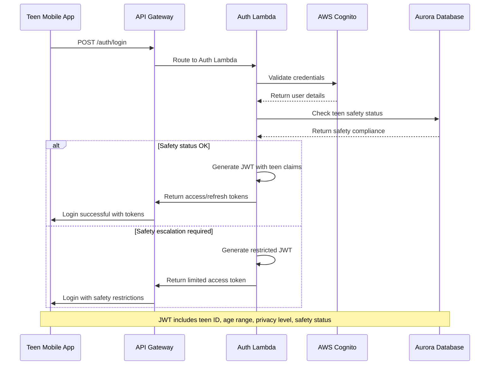

# Backend Architecture

## Service Architecture

### Function Organization
```
services/
├── ai-conversation/           # AI conversation processing
│   ├── src/
│   │   ├── handlers/
│   │   │   ├── messageHandler.ts      # Process teen messages
│   │   │   ├── voiceHandler.ts        # Voice transcription/synthesis
│   │   │   └── contextHandler.ts      # Conversation memory management
│   │   ├── services/
│   │   │   ├── bedrockService.ts      # AWS Bedrock AI integration
│   │   │   ├── safetyService.ts       # Content safety checking
│   │   │   └── encryptionService.ts   # Message encryption/decryption
│   │   ├── models/
│   │   │   ├── conversation.ts        # Conversation domain models
│   │   │   └── message.ts             # Message domain models
│   │   └── utils/
│   │       ├── promptEngineering.ts   # Teen-safe AI prompting
│   │       └── performanceUtils.ts    # Response time optimization
│   ├── serverless.yml              # Serverless Framework config
│   └── package.json
├── safety-pipeline/           # Content moderation and crisis detection
│   ├── src/
│   │   ├── handlers/
│   │   │   ├── contentAnalysisHandler.ts  # Real-time content analysis
│   │   │   ├── crisisDetectionHandler.ts  # ML-based crisis detection
│   │   │   └── escalationHandler.ts       # Crisis response workflows
│   │   ├── services/
│   │   │   ├── comprehendService.ts       # AWS Comprehend integration
│   │   │   ├── sagemakerService.ts        # Custom ML model inference
│   │   │   └── notificationService.ts     # Crisis alert delivery
│   │   └── models/
│   │       ├── safetyIncident.ts          # Safety incident domain
│   │       └── crisisResponse.ts          # Crisis response workflows
├── family-service/           # Family management and privacy
│   ├── src/
│   │   ├── handlers/
│   │   │   ├── familyHandler.ts           # Family account management
│   │   │   ├── privacyHandler.ts          # Privacy rule enforcement
│   │   │   └── dashboardHandler.ts        # Parent dashboard data
│   │   ├── services/
│   │   │   ├── cognitoService.ts          # Family authentication
│   │   │   ├── privacyEngine.ts           # Age-graduated privacy logic
│   │   │   └── analyticsService.ts        # Family progress analytics
│   │   └── models/
│   │       ├── family.ts                  # Family domain models
│   │       └── privacy.ts                 # Privacy settings models
└── shared/                    # Shared utilities across services
    ├── src/
    │   ├── middleware/
    │   │   ├── authMiddleware.ts          # JWT token validation
    │   │   ├── errorHandler.ts            # Standardized error handling
    │   │   └── auditLogger.ts             # Compliance audit logging
    │   ├── types/
    │   │   ├── api.ts                     # Shared API types
    │   │   ├── database.ts                # Database entity types
    │   │   └── events.ts                  # Inter-service event types
    │   └── utils/
    │       ├── encryption.ts              # Shared encryption utilities
    │       ├── validation.ts              # Input validation schemas
    │       └── metrics.ts                 # Performance monitoring
```

### Function Template
```typescript
import { APIGatewayProxyHandler, APIGatewayProxyEvent, Context } from 'aws-lambda';
import { middyfy } from '@shared/middleware';
import { BedrockService } from '../services/bedrockService';
import { SafetyService } from '../services/safetyService';
import { EncryptionService } from '../services/encryptionService';
import { auditLogger } from '@shared/utils/auditLogger';
import { ConversationMessage } from '@shared/types/database';

interface SendMessageRequest {
  conversationId: string;
  content: string;
  messageType: 'text' | 'voice';
  voiceFileUrl?: string;
}

interface SendMessageResponse {
  userMessage: ConversationMessage;
  aiResponse: ConversationMessage;
  safetyCheck: SafetyCheckResult;
}

const messageHandler: APIGatewayProxyHandler = async (
  event: APIGatewayProxyEvent,
  context: Context
) => {
  const startTime = Date.now();
  const { conversationId } = event.pathParameters!;
  const requestBody: SendMessageRequest = JSON.parse(event.body!);

  try {
    // Extract teen user ID from JWT token
    const teenUserId = event.requestContext.authorizer?.teenUserId;
    if (!teenUserId) {
      throw new Error('Unauthorized: Invalid teen user token');
    }

    // Decrypt incoming message content
    const encryptionService = new EncryptionService();
    const decryptedContent = await encryptionService.decrypt(
      requestBody.content,
      teenUserId
    );

    // Real-time safety analysis (non-blocking)
    const safetyService = new SafetyService();
    const safetyCheckPromise = safetyService.analyzeContent(
      decryptedContent,
      teenUserId,
      conversationId
    );

    // Generate AI response using Bedrock
    const bedrockService = new BedrockService();
    const conversationContext = await getConversationContext(conversationId);

    const aiResponsePromise = bedrockService.generateResponse({
      message: decryptedContent,
      context: conversationContext,
      teenAge: await getTeenAgeRange(teenUserId),
      safetyMode: 'teen-safe'
    });

    // Wait for both safety check and AI response
    const [safetyCheck, aiResponse] = await Promise.all([
      safetyCheckPromise,
      aiResponsePromise
    ]);

    // Block response if safety issues detected
    if (safetyCheck.escalationRequired) {
      await handleCrisisEscalation(safetyCheck, teenUserId);
      return {
        statusCode: 202,
        body: JSON.stringify({
          message: 'Your message has been received. A support specialist will be in touch.',
          supportContact: process.env.CRISIS_SUPPORT_NUMBER
        })
      };
    }

    // Encrypt and store both messages
    const encryptedUserMessage = await encryptionService.encrypt(
      decryptedContent,
      teenUserId
    );
    const encryptedAiMessage = await encryptionService.encrypt(
      aiResponse.content,
      teenUserId
    );

    // Store messages in database
    const userMessage = await storeMessage({
      conversationId,
      sender: 'teen',
      content: encryptedUserMessage,
      messageType: requestBody.messageType,
      voiceFileUrl: requestBody.voiceFileUrl,
      safetyScore: safetyCheck.score
    });

    const aiMessage = await storeMessage({
      conversationId,
      sender: 'ai',
      content: encryptedAiMessage,
      messageType: 'text',
      aiModelVersion: aiResponse.modelVersion,
      processingTimeMs: Date.now() - startTime
    });

    // Audit log for compliance
    await auditLogger.log({
      action: 'conversation_message',
      teenUserId,
      conversationId,
      safetyScore: safetyCheck.score,
      processingTimeMs: Date.now() - startTime
    });

    return {
      statusCode: 201,
      headers: {
        'X-Processing-Time': `${Date.now() - startTime}ms`,
        'X-Safety-Score': safetyCheck.score.toString()
      },
      body: JSON.stringify({
        userMessage: {
          ...userMessage,
          content: decryptedContent // Return decrypted for client
        },
        aiResponse: {
          ...aiMessage,
          content: aiResponse.content
        },
        safetyCheck: {
          score: safetyCheck.score,
          flags: safetyCheck.flags,
          escalationRequired: false
        }
      })
    };

  } catch (error) {
    // Comprehensive error handling with teen safety considerations
    await auditLogger.error({
      action: 'conversation_error',
      error: error.message,
      teenUserId: event.requestContext.authorizer?.teenUserId,
      conversationId,
      processingTimeMs: Date.now() - startTime
    });

    if (error.message.includes('safety')) {
      return {
        statusCode: 400,
        body: JSON.stringify({
          error: 'Message could not be processed for safety reasons',
          supportContact: process.env.CRISIS_SUPPORT_NUMBER
        })
      };
    }

    throw error; // Let middleware handle other errors
  }
};

// Middleware stack for Lambda functions
export const handler = middyfy(messageHandler)
  .use(authMiddleware({ requireTeenAuth: true }))
  .use(errorHandler())
  .use(auditLogger.middleware())
  .use(performanceMonitoring());
```

## Database Architecture

### Data Access Layer
```typescript
import { Pool, PoolClient } from 'pg';
import { ConversationMessage, Conversation } from '@shared/types/database';
import { encryptionService } from '@shared/utils/encryption';

class ConversationRepository {
  private pool: Pool;

  constructor() {
    this.pool = new Pool({
      host: process.env.RDS_PROXY_ENDPOINT,
      port: 5432,
      database: process.env.DB_NAME,
      user: process.env.DB_USER,
      password: process.env.DB_PASSWORD,
      max: 2, // Limit connections for Lambda
      idleTimeoutMillis: 30000,
      connectionTimeoutMillis: 2000,
    });
  }

  async storeMessage(message: Partial<ConversationMessage>): Promise<ConversationMessage> {
    const client = await this.pool.connect();

    try {
      await client.query('BEGIN');

      // Insert message with encryption
      const messageQuery = `
        INSERT INTO conversation_messages (
          conversation_id, sender, encrypted_content, message_type,
          voice_file_s3_key, safety_flags, ai_model_version, processing_time_ms
        ) VALUES ($1, $2, $3, $4, $5, $6, $7, $8)
        RETURNING id, created_at
      `;

      const messageResult = await client.query(messageQuery, [
        message.conversationId,
        message.sender,
        message.encryptedContent,
        message.messageType,
        message.voiceFileS3Key,
        message.safetyFlags || [],
        message.aiModelVersion,
        message.processingTimeMs
      ]);

      // Update conversation metadata
      const updateConversationQuery = `
        UPDATE conversations
        SET message_count = message_count + 1,
            last_message_at = CURRENT_TIMESTAMP,
            updated_at = CURRENT_TIMESTAMP
        WHERE id = $1
      `;

      await client.query(updateConversationQuery, [message.conversationId]);

      await client.query('COMMIT');

      return {
        id: messageResult.rows[0].id,
        createdAt: messageResult.rows[0].created_at,
        ...message
      } as ConversationMessage;

    } catch (error) {
      await client.query('ROLLBACK');
      throw error;
    } finally {
      client.release();
    }
  }

  async getConversationContext(
    conversationId: string,
    limit: number = 10
  ): Promise<ConversationMessage[]> {
    const query = `
      SELECT id, sender, encrypted_content, message_type, created_at
      FROM conversation_messages
      WHERE conversation_id = $1
      ORDER BY created_at DESC
      LIMIT $2
    `;

    const result = await this.pool.query(query, [conversationId, limit]);

    // Decrypt messages for AI context (server-side only)
    return Promise.all(
      result.rows.map(async (row) => ({
        ...row,
        content: await encryptionService.decrypt(row.encrypted_content)
      }))
    );
  }

  async getConversationsByTeen(
    teenUserId: string,
    limit: number = 20,
    before?: Date
  ): Promise<Conversation[]> {
    let query = `
      SELECT id, title, emotional_tone, message_count, last_message_at, parent_sharable
      FROM conversations
      WHERE teen_user_id = $1
    `;

    const params: any[] = [teenUserId];

    if (before) {
      query += ` AND last_message_at < $2`;
      params.push(before);
    }

    query += ` ORDER BY last_message_at DESC LIMIT $${params.length + 1}`;
    params.push(limit);

    const result = await this.pool.query(query, params);
    return result.rows;
  }
}

export const conversationRepository = new ConversationRepository();
```

## Authentication and Authorization

### Auth Flow


### Middleware/Guards
```typescript
import { APIGatewayProxyEvent, APIGatewayProxyResult } from 'aws-lambda';
import jwt from 'jsonwebtoken';
import { TeenUser, PrivacyLevel } from '@shared/types/database';

interface TeenJWTClaims {
  sub: string; // teen user ID
  ageRange: '13-14' | '15-16' | '17-18';
  privacyLevel: PrivacyLevel;
  safetyStatus: string;
  familyId?: string;
  iat: number;
  exp: number;
}

export const authMiddleware = (options: {
  requireTeenAuth: boolean;
  minimumAge?: string;
  requireParentConsent?: boolean;
}) => {
  return {
    before: async (request: { event: APIGatewayProxyEvent }) => {
      const { event } = request;

      // Extract JWT token from Authorization header
      const authHeader = event.headers.Authorization || event.headers.authorization;
      if (!authHeader || !authHeader.startsWith('Bearer ')) {
        throw new Error('Missing or invalid authorization header');
      }

      const token = authHeader.substring(7);

      try {
        // Verify JWT token with AWS Cognito public keys
        const decoded = jwt.verify(token, process.env.JWT_SECRET!) as TeenJWTClaims;

        // Age-based route protection
        if (options.minimumAge) {
          if (!meetsAgeRequirement(decoded.ageRange, options.minimumAge)) {
            throw new Error('Insufficient age permissions for this resource');
          }
        }

        // Safety status validation
        if (decoded.safetyStatus === 'escalated') {
          throw new Error('Account under safety review - limited access');
        }

        // Parent consent validation for younger teens
        if (options.requireParentConsent && decoded.ageRange === '13-14') {
          const parentConsent = await checkParentConsent(decoded.sub);
          if (!parentConsent) {
            throw new Error('Parent consent required for this action');
          }
        }

        // Add teen context to request
        event.requestContext.authorizer = {
          teenUserId: decoded.sub,
          ageRange: decoded.ageRange,
          privacyLevel: decoded.privacyLevel,
          familyId: decoded.familyId,
          safetyStatus: decoded.safetyStatus
        };

      } catch (error) {
        throw new Error(`Authentication failed: ${error.message}`);
      }
    }
  };
};

const meetsAgeRequirement = (userAge: string, requiredAge: string): boolean => {
  const ageOrder = ['13-14', '15-16', '17-18'];
  return ageOrder.indexOf(userAge) >= ageOrder.indexOf(requiredAge);
};

const checkParentConsent = async (teenUserId: string): Promise<boolean> => {
  // Query database for parent consent status
  // Implementation would check families table for consent
  return true; // Simplified for example
};
```
