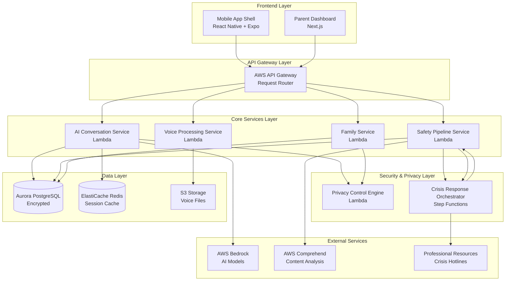

# Component Diagrams

```mermaid
graph TB
    subgraph "Frontend Layer"
        A[Mobile App Shell<br/>React Native + Expo]
        B[Parent Dashboard<br/>Next.js]
    end

    subgraph "API Gateway Layer"
        C[AWS API Gateway<br/>Request Router]
    end

    subgraph "Core Services Layer"
        D[AI Conversation Service<br/>Lambda]
        E[Safety Pipeline Service<br/>Lambda]
        F[Family Service<br/>Lambda]
        G[Voice Processing Service<br/>Lambda]
    end

    subgraph "Security & Privacy Layer"
        H[Privacy Control Engine<br/>Lambda]
        I[Crisis Response Orchestrator<br/>Step Functions]
    end

    subgraph "Data Layer"
        J[(Aurora PostgreSQL<br/>Encrypted)]
        K[(ElastiCache Redis<br/>Session Cache)]
        L[S3 Storage<br/>Voice Files]
    end

    subgraph "External Services"
        M[AWS Bedrock<br/>AI Models]
        N[AWS Comprehend<br/>Content Analysis]
        O[Professional Resources<br/>Crisis Hotlines]
    end

    A --> C
    B --> C
    C --> D
    C --> E
    C --> F
    C --> G

    D --> H
    E --> I
    F --> H

    D --> J
    D --> K
    D --> M
    E --> J
    E --> N
    E --> I
    F --> J
    G --> L

    I --> O
    I --> E
```
