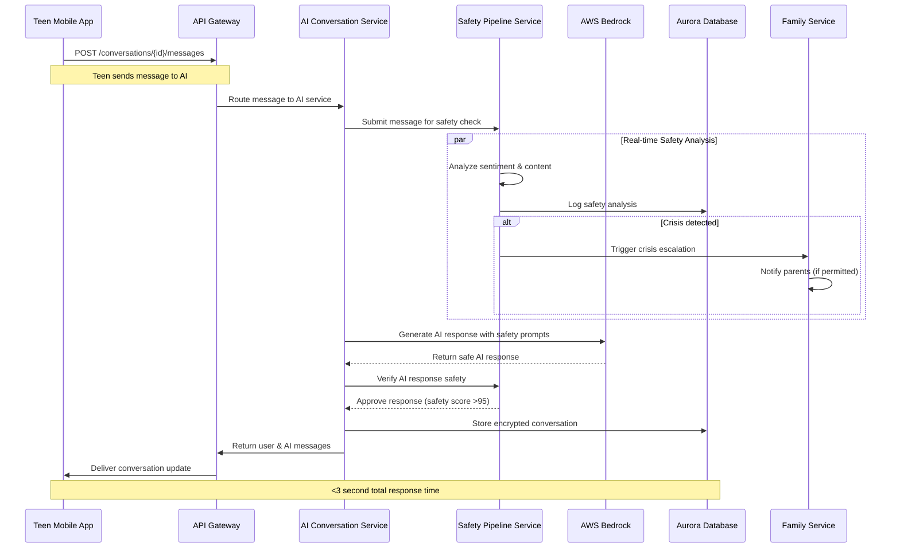
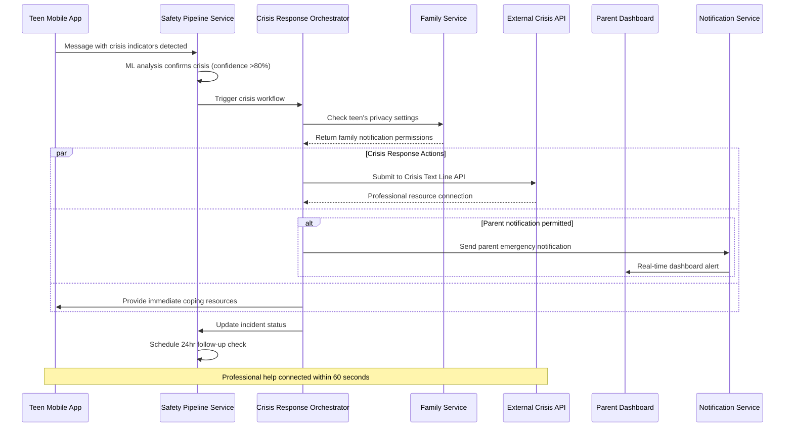
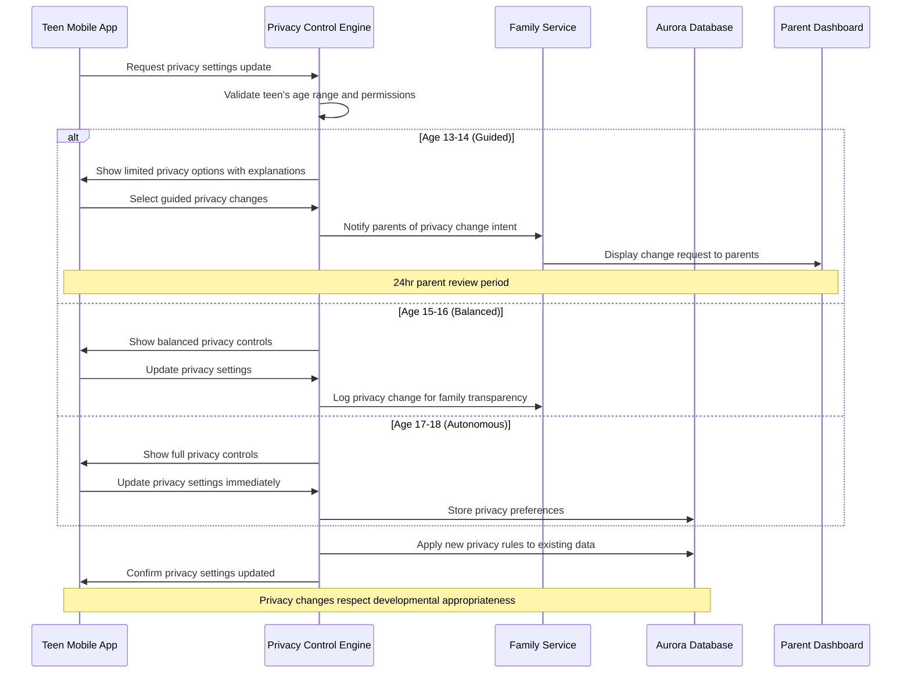
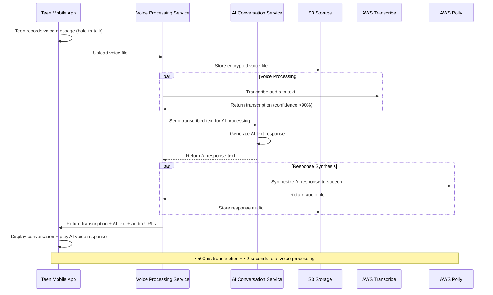
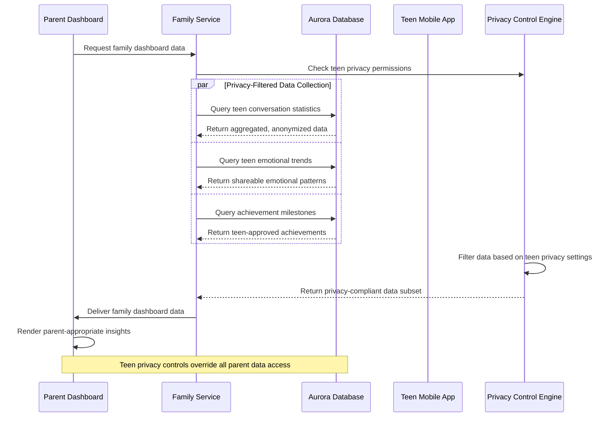

# Core Workflows

## AI Conversation with Safety Monitoring

## Crisis Detection and Family Escalation

## Age-Graduated Privacy Control Update

## Voice Conversation Processing

## Family Dashboard Data Aggregation

