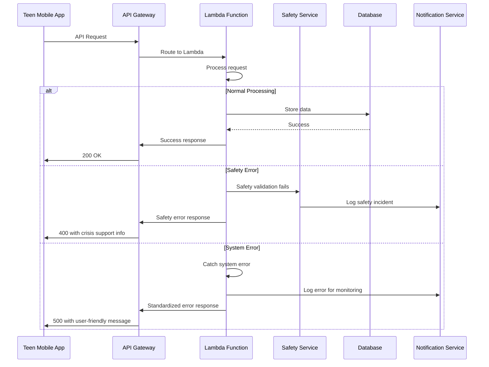

# Error Handling Strategy

## Error Flow


## Error Response Format
```typescript
interface ApiError {
  error: {
    code: string;
    message: string;
    details?: Record<string, any>;
    timestamp: string;
    requestId: string;
  };
}
```

## Frontend Error Handling
```typescript
import { createListenerMiddleware } from '@reduxjs/toolkit';
import { conversationApi } from '../services/conversationApi';
import { showCrisisSupport } from '../stores/safetySlice';

const errorMiddleware = createListenerMiddleware();

// Handle safety-related API errors
errorMiddleware.startListening({
  matcher: conversationApi.endpoints.sendMessage.matchRejected,
  effect: async (action, listenerApi) => {
    const error = action.payload;

    if (error?.status === 400 && error.data?.error?.code === 'SAFETY_VIOLATION') {
      // Show crisis support immediately for safety violations
      listenerApi.dispatch(showCrisisSupport({
        message: error.data.error.message,
        supportContact: error.data.supportContact,
        resources: error.data.crisisResources
      }));
    } else if (error?.status >= 500) {
      // Handle system errors with user-friendly messaging
      listenerApi.dispatch(showErrorMessage({
        title: 'Connection Issue',
        message: 'We\'re having trouble connecting right now. Your message will be sent when we reconnect.',
        type: 'network-error'
      }));
    }
  },
});

export default errorMiddleware;
```

## Backend Error Handling
```typescript
import { APIGatewayProxyEvent, APIGatewayProxyResult } from 'aws-lambda';
import { auditLogger } from '@shared/utils/auditLogger';

export const errorHandler = () => ({
  onError: async (request: { event: APIGatewayProxyEvent; error: Error }) => {
    const { event, error } = request;
    const requestId = event.requestContext.requestId;
    const teenUserId = event.requestContext.authorizer?.teenUserId;

    // Log error for monitoring and compliance
    await auditLogger.error({
      requestId,
      teenUserId,
      error: error.message,
      stack: error.stack,
      endpoint: event.path,
      method: event.httpMethod,
      userAgent: event.headers['User-Agent'],
      timestamp: new Date().toISOString()
    });

    // Determine error type and appropriate response
    let statusCode = 500;
    let errorCode = 'INTERNAL_ERROR';
    let message = 'Something went wrong. Please try again.';

    if (error.message.includes('safety')) {
      statusCode = 400;
      errorCode = 'SAFETY_VIOLATION';
      message = 'Your message couldn\'t be processed for safety reasons.';
    } else if (error.message.includes('auth')) {
      statusCode = 401;
      errorCode = 'AUTHENTICATION_ERROR';
      message = 'Please log in again to continue.';
    } else if (error.message.includes('age')) {
      statusCode = 403;
      errorCode = 'AGE_RESTRICTION';
      message = 'This feature isn\'t available for your age group.';
    }

    const errorResponse: APIGatewayProxyResult = {
      statusCode,
      headers: {
        'Content-Type': 'application/json',
        'X-Request-ID': requestId
      },
      body: JSON.stringify({
        error: {
          code: errorCode,
          message,
          timestamp: new Date().toISOString(),
          requestId
        },
        // Include crisis support for safety errors
        ...(errorCode === 'SAFETY_VIOLATION' && {
          supportContact: process.env.CRISIS_SUPPORT_NUMBER,
          crisisResources: [
            {
              name: 'Crisis Text Line',
              contact: 'Text HOME to 741741',
              description: 'Free 24/7 crisis support'
            }
          ]
        })
      })
    };

    return errorResponse;
  }
});
```
