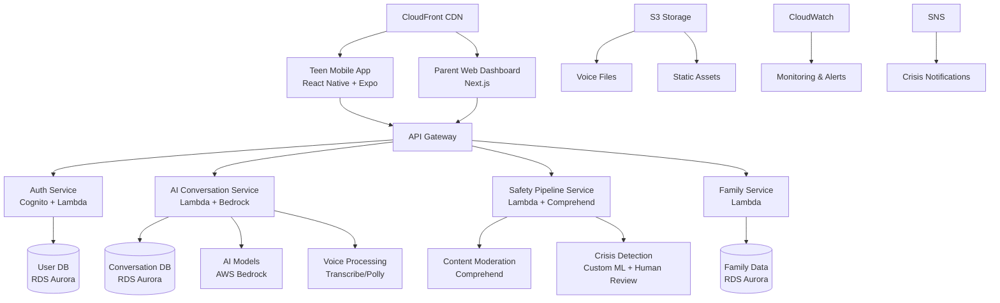

# High Level Architecture

## Technical Summary

Amicly employs a **hybrid serverless microservices architecture** extending the proven ReferenceApp-Expo React Native foundation with dedicated AI conversation services. The frontend maintains conversation-first UX through the existing Z-component library with six-theme support while new backend microservices handle AI processing, safety monitoring, and family dashboard functionality. **AWS platform** provides enterprise-grade safety compliance and scalability for AI workloads, with API Gateway orchestrating communication between the React Native app and specialized Lambda functions. This architecture achieves PRD goals by ensuring <3 second AI response times, 99.5% safety compliance, and COPPA-compliant family privacy controls while maintaining the proven mobile experience foundation with sophisticated theming capabilities.

## Platform and Infrastructure Choice

**Platform:** AWS
**Key Services:** Lambda, API Gateway, Cognito, RDS Aurora Serverless, S3, Bedrock, Comprehend, CloudWatch
**Deployment Host and Regions:** US-East-1 (primary), US-West-2 (DR), with edge locations via CloudFront

## Repository Structure

**Structure:** Monorepo extending existing ReferenceApp-Expo foundation
**Monorepo Tool:** Continuing with existing ReferenceApp-Expo tooling (likely npm workspaces or Lerna)
**Package Organization:**
- `apps/mobile` - Extended ReferenceApp-Expo React Native app with six-theme architecture
- `apps/parent-dashboard` - Next.js web app for parents
- `services/ai-conversation` - Lambda-based AI processing service
- `services/safety-pipeline` - Content moderation and crisis detection
- `packages/shared` - Shared types, utilities, and Z-component extensions
- `packages/referenceapp-z-extended` - Extended ReferenceApp Z-component library

## High Level Architecture Diagram

## Architectural Patterns

- **Serverless Microservices:** Individual Lambda functions for AI conversation, safety monitoring, and family management - _Rationale:_ Enables independent scaling and deployment while maintaining cost efficiency for variable AI workloads

- **API Gateway Pattern:** Single entry point with request routing and rate limiting - _Rationale:_ Centralizes authentication, provides DDoS protection, and enables monitoring of all teen interactions for safety compliance

- **Event-Driven Safety Pipeline:** Asynchronous processing of conversation content for crisis detection - _Rationale:_ Ensures safety monitoring doesn't impact conversation response times while maintaining comprehensive coverage

- **CQRS for Conversation Data:** Separate read/write models for conversation storage and retrieval - _Rationale:_ Optimizes for both real-time conversation flow and complex family privacy query patterns

- **Circuit Breaker for AI Services:** Graceful degradation when AI services are unavailable - _Rationale:_ Maintains app functionality during AI service outages with cached responses and offline conversation history

- **Progressive Web App for Parent Dashboard:** Web-based parent interface with mobile-responsive design - _Rationale:_ Avoids app store approval complexities while providing rich parent experience across devices
