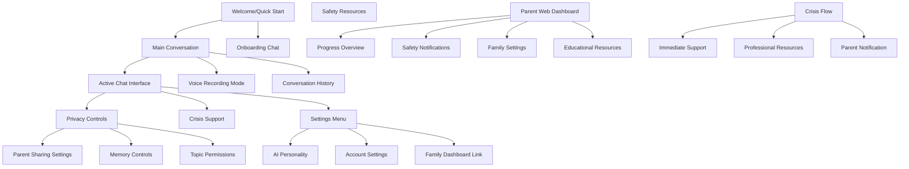
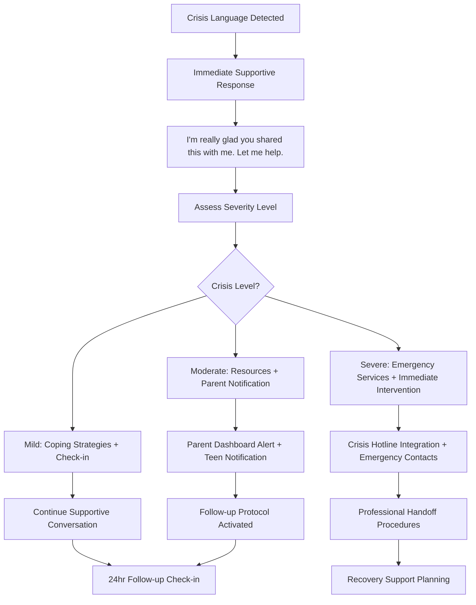
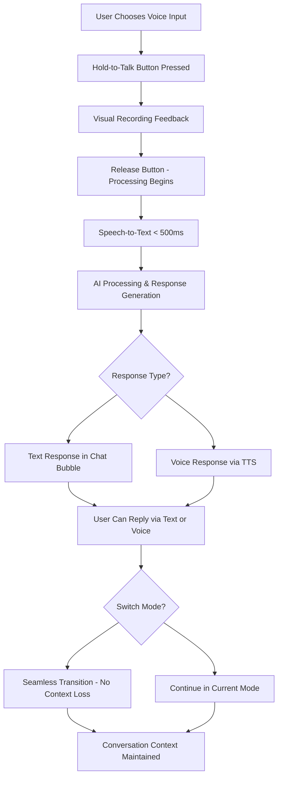

# Amicly UI/UX Specification

This document defines the user experience goals, information architecture, user flows, and visual design specifications for **Amicly**'s user interface. It serves as the foundation for visual design and frontend development, ensuring a cohesive and user-centered experience.

## Overall UX Goals & Principles

### Target User Personas

**Primary Teen User (13-15):**
- **"Safety-Conscious Emma"** - Needs emotional support and life guidance while parents maintain appropriate oversight. Values privacy but understands safety comes first. Prefers messaging-style interactions over complex apps.

**Secondary Teen User (16-18):**
- **"Independent Alex"** - Wants sophisticated AI companion with high privacy controls. Seeks real-world skill development and emotional intelligence. Values authentic conversations over entertainment.

**Parent User:**
- **"Protective Patricia"** - Safety-focused parent who wants beneficial technology for teen. Needs transparency about AI interactions while respecting teen's growing autonomy. Values developmental appropriateness.

### Usability Goals

- **Immediate Engagement:** New teens can start meaningful AI conversations within 30 seconds using anonymous quick-start flow
- **Conversational Mastery:** 95% of interactions happen through natural conversation rather than navigation menus
- **Privacy Transparency:** Teens and parents understand privacy controls within first 3 conversations
- **Crisis Support Excellence:** Crisis detection triggers appropriate help within 60 seconds while maintaining user trust
- **Cross-Modal Fluidity:** Voice-to-text switching feels seamless without conversation context loss

### Design Principles

1. **Conversation-First Above All** - Every feature accessible through natural dialogue; traditional app navigation is secondary
2. **Safety Through Transparency** - Privacy controls are visible and understandable, never hidden or complex
3. **Warm Minimalism** - Clean aesthetics that feel mature for teens while reassuring parents about safety
4. **Developmental Respect** - UI evolves with teen's age and maturity level, supporting growing autonomy
5. **ReferenceApp-Expo Foundation** - Leverage existing component library and technical patterns for consistency and speed

### Change Log
| Date | Version | Description | Author |
|------|---------|-------------|---------|
| 2025-09-28 | v1.0 | Initial UI/UX specification creation | Sally (UX Expert) |

## Information Architecture (IA)

### Site Map / Screen Inventory



### Navigation Structure

**Primary Navigation:** Conversation-centric design where 80% of features are accessed through natural AI dialogue ("Can you forget yesterday's conversation?" or "Show my privacy settings"). Only essential functions have traditional UI elements.

**Secondary Navigation:** Contextual slide-up panels and conversational prompts. Settings accessed via chat commands or subtle UI hints during relevant conversations. Voice/text toggle as persistent floating action button.

**Breadcrumb Strategy:** Conversation thread continuity rather than traditional breadcrumbs. Users navigate through dialogue history and topic threads. Context maintained through AI memory rather than navigation hierarchy.

## User Flows

### Flow 1: Anonymous Quick-Start to First Conversation

**User Goal:** Start meaningful AI conversation immediately without signup friction

**Entry Points:** App launch, app store download, friend referral

**Success Criteria:** Teen engaged in authentic conversation within 60 seconds

#### Flow Diagram

```mermaid
graph TD
    A[App Launch] --> B[Welcome Screen - 5 sec]
    B --> C[Quick Intro: "Hi! I'm your AI companion. Ready to chat?"]
    C --> D[Immediate Chat Interface]
    D --> E[First AI Response Within 3 sec]
    E --> F[Natural Conversation Begins]
    F --> G{After 3-5 Messages}
    G --> H[Gentle Account Prompt: "Want me to remember this?"]
    H --> I[Continue Anonymous]
    H --> J[Create Account]
    I --> K[Session-Based Memory Only]
    J --> L[Progressive Registration Flow]
```

#### Edge Cases & Error Handling:
- Network failure: Cached welcome conversation starters available offline
- Slow AI response: Typing indicators with encouraging messages ("Thinking about what you said...")
- Inappropriate first message: Gentle redirection ("Let's start with something fun! What's your favorite...")

### Flow 2: Age-Graduated Privacy Control Discovery

**User Goal:** Understand and control privacy settings appropriate to developmental stage

**Entry Points:** Onboarding, settings conversation, parent discussion prompt, age birthday

**Success Criteria:** Teen feels informed and in control of privacy decisions

#### Flow Diagram

```mermaid
graph TD
    A[Privacy Topic Triggered] --> B{User Age Check}
    B --> C[Age 13-14: Guided Privacy Tour]
    B --> D[Age 15-16: Balanced Control Explanation]
    B --> E[Age 17-18: Full Autonomy Explanation]

    C --> F["Your parents can see general topics we discuss for safety"]
    D --> G["You control most sharing - parents see progress updates"]
    E --> H["You have full privacy control - crisis situations only exception"]

    F --> I[Simple Toggle Interface]
    G --> I
    H --> I

    I --> J[Test Understanding: "What would your parents see if...?"]
    J --> K[Confirmation & Settings Applied]
    K --> L[Conversation Continues Naturally]
```

#### Edge Cases & Error Handling:
- Age verification concerns: Manual review process with human moderator
- Parent-teen privacy conflicts: Mediated conversation suggestions
- Settings confusion: Visual examples of what parents can/cannot see

### Flow 3: Crisis Detection and Support Activation

**User Goal:** Receive appropriate help during mental health crisis while maintaining trust

**Entry Points:** Crisis language detection, explicit help request, safety keyword triggers

**Success Criteria:** Teen receives immediate support while appropriate parties are notified

#### Flow Diagram



#### Edge Cases & Error Handling:
- False positive detection: Gentle clarification without breaking conversation flow
- Parent unavailable during crisis: Emergency contact escalation procedures
- Teen refuses help: Continued gentle support with safety monitoring

### Flow 4: Voice-Text Multimodal Conversation

**User Goal:** Seamlessly switch between voice and text communication modes

**Entry Points:** Hold-to-talk button, voice command activation, accessibility needs

**Success Criteria:** Natural conversation continues regardless of input method

#### Flow Diagram



#### Edge Cases & Error Handling:
- Poor audio quality: Retry prompt with tips for better recording
- Network issues during voice: Graceful fallback to text mode
- Background noise: Noise detection with recording environment suggestions

## Wireframes & Mockups

**Primary Design Files:** Design system will extend ReferenceApp-Expo component library in Figma, with new conversation-focused components for AI interaction patterns.

### Key Screen Layouts

#### Screen 1: Main Conversation Interface

**Purpose:** Primary interaction space where 80% of user time is spent - natural AI conversation with contextual features

**Key Elements:**
- Full-screen chat interface with messaging-app familiarity (WhatsApp/iMessage patterns)
- Floating voice recording button (primary CTA) with visual feedback
- Subtle AI personality indicators (typing animations, response timing, contextual emoji)
- Conversational privacy controls ("Ask about sharing settings")
- Emergency/crisis support accessible via chat or discrete UI element

**Interaction Notes:** Chat bubbles expand/contract based on voice vs text input. Voice recording shows waveform animation. AI responses include subtle personality touches (timing variations, thoughtful pauses).

**Design File Reference:** `conversation-interface-main.fig` - Mobile-first responsive design

#### Screen 2: Progressive Privacy Control Interface

**Purpose:** Age-appropriate privacy management that feels educational rather than overwhelming

**Key Elements:**
- Visual toggle interface showing parent visibility levels
- Age-appropriate explanations with developmental psychology backing
- "What would parents see?" preview functionality
- Conversation-based settings access ("Tell me about privacy")
- Clear crisis override explanations

**Interaction Notes:** Visual examples rather than abstract settings. Privacy changes include confirmation dialogs with clear explanations. Parent notification preview reduces family conflicts.

**Design File Reference:** `privacy-controls-graduated.fig` - Age-adaptive interface variations

#### Screen 3: Crisis Support Interface

**Purpose:** Immediate support during mental health emergencies while maintaining user trust

**Key Elements:**
- Warm, non-clinical crisis response UI
- Direct hotline integration with one-tap calling
- Resource cards for immediate coping strategies
- Clear explanation of what happens next (parent notification, professional help)
- Gentle transition back to normal conversation

**Interaction Notes:** Interface adapts based on crisis severity. Professional language balanced with teen-friendly explanations. Visual calm through color and typography choices.

**Design File Reference:** `crisis-support-flow.fig` - High-stakes interaction design

## Component Library / Design System

**Design System Approach:** Extend existing ReferenceApp-Expo React Native component library with AI conversation-specific components. Maintain design token consistency while adding new patterns for natural language interfaces, age-graduated controls, and crisis support.

### Core Components

#### Component 1: ConversationBubble

**Purpose:** Primary content container for AI and user messages with personality and context awareness

**Variants:**
- User message (right-aligned, personal color)
- AI message (left-aligned, warm assistant color)
- System message (centered, neutral styling)
- Crisis support (special warm styling with subtle attention indicators)

**States:** Sending, delivered, typing indicator, error state, voice transcript, emergency escalation

**Usage Guidelines:** Maintain messaging app familiarity while adding AI personality through subtle animations and spacing. Voice messages include waveform visualization. Crisis messages use calming visual treatment.

#### Component 2: VoiceRecordingInterface

**Purpose:** Hold-to-talk voice recording with visual feedback and seamless text integration

**Variants:**
- Standard recording mode (primary action)
- Accessibility mode (tap-to-start/stop)
- Voice-to-text display mode
- Network fallback mode

**States:** Idle, recording, processing, transcribing, error, offline mode

**Usage Guidelines:** Visual feedback essential for recording confidence. Waveform animation during recording. Transcription appears in real-time when possible. Graceful network fallback.

#### Component 3: PrivacyControlToggle

**Purpose:** Age-appropriate privacy controls with visual transparency and family understanding

**Variants:**
- Age 13-14: Guided control with explanations
- Age 15-16: Balanced control interface
- Age 17-18: Full autonomy interface
- Parent view: Read-only transparency display

**States:** Default setting, modified by teen, parent notification pending, crisis override active

**Usage Guidelines:** Visual examples show what parents can/cannot see. Changes include confirmation flows. Crisis override clearly explained. Educational content integrated.

#### Component 4: CrisisDetectionInterface

**Purpose:** Immediate support delivery during mental health emergencies with trust preservation

**Variants:**
- Mild concern: Gentle check-in with coping resources
- Moderate concern: Resource cards with parent notification
- Severe concern: Emergency contact integration with professional handoff

**States:** Detection triggered, resources presented, escalation in progress, follow-up scheduled

**Usage Guidelines:** Warm, non-clinical visual treatment. Clear next steps without overwhelming. Professional language balanced with teen-friendly tone. Maintains conversation context.

#### Component 5: ContextualLifeCoaching

**Purpose:** Natural integration of life skills guidance within ongoing conversations

**Variants:**
- Academic support (study strategies, homework help)
- Social guidance (friendship advice, conflict resolution)
- Emotional regulation (coping strategies, mindfulness)
- Goal setting (habit formation, achievement tracking)

**States:** Contextual trigger, guidance active, progress tracking, celebration mode, setback support

**Usage Guidelines:** Embedded within natural conversation flow. Guidance feels conversational rather than instructional. Progress celebration is age-appropriate. Setback support maintains encouragement.

## Branding & Style Guide

Building on the proven **ReferenceApp-Expo design system** with conversation-focused adaptations for AI companion interactions.

### Visual Identity

**Brand Guidelines:** Extend ReferenceApp-Expo design system foundation while adapting for trustworthy AI companion personality that appeals to teens and reassures parents.

### Color Palette

| Color Type | Hex Code | Usage |
|------------|----------|--------|
| Primary | **#FF4D67** | ReferenceApp-Expo primary (vibrant red-pink) - adapted for AI personality, key actions |
| Primary Transparent | **#FF4D6714** | Subtle highlights, conversation focus states |
| Light Background | **#FFFFFF** | Light theme conversation background |
| Light Text | **#212121** | Primary text in light theme |
| Light Input Background | **#FAFAFA** | Input fields, message composition |
| Light Icons | **#9E9E9E** | Secondary UI elements |
| Dark Background | **#181A20** | Dark theme conversation background |
| Dark Text | **#FFFFFF** | Primary text in dark theme |
| Dark Input Background | **#1F222A** | Input fields in dark mode |
| Dark Icons | **#616161** | Secondary UI elements in dark mode |
| Accent Orange | **#FB9400** | Life coaching, achievement notifications |
| Accent Blue | **#7210FF** | Privacy controls, parent communication |
| Accent Yellow | **#FFD300** | Warnings, attention-needed states |
| Accent Red | **#F75555** | Crisis detection, urgent safety alerts |

### Typography

#### Font Families
- **Primary:** **Urbanist** (ReferenceApp-Expo standard) - modern, friendly, teen-appropriate
- **Secondary:** System fonts for performance-critical conversation rendering
- **Monospace:** System monospace for technical elements

#### Type Scale

| Element | Size | Weight | Line Height |
|---------|------|--------|-------------|
| H1 | 28px | 600 | 1.2 |
| H2 | 24px | 600 | 1.3 |
| H3 | 20px | 500 | 1.4 |
| Body | 16px | 400 | 1.5 |
| Small | 14px | 400 | 1.4 |

### Iconography

**Icon Library:** Extend ReferenceApp-Expo icon system with conversation-specific icons - voice recording, privacy controls, crisis support, life coaching indicators

**Usage Guidelines:** Icons maintain warm personality through subtle rounded corners and consistent stroke weight. Crisis icons avoid clinical appearance. Privacy icons emphasize transparency and control.

### Spacing & Layout

**Grid System:** 8px base grid extending ReferenceApp-Expo foundation with conversation-optimized spacing for reading comfort and voice interaction

**Spacing Scale:** 4px, 8px, 16px, 24px, 32px, 48px, 64px - optimized for comfortable conversation reading and voice recording interfaces

### Component Foundation

**Z-Component Library Extensions:**
- Leverage existing **ZButton**, **ZInput**, **ZText** components
- Custom responsive scaling functions from ReferenceApp-Expo
- Redux-managed light/dark theme switching integrated with conversation interface

### Conversation-Specific Adaptations

**AI Personality Colors:**
- AI messages use softened **#FF4D67** variants for warm but non-intrusive presence
- User messages maintain personal space with subtle **#FAFAFA** (light) / **#1F222A** (dark) backgrounds
- Crisis support uses calming **#7210FF** blues rather than alarming reds

**Trust-Building Visual Strategy:**
- Primary red-pink conveys energy and engagement for teens
- Balanced with professional blues for parent-facing features
- Dark mode essential for teen comfort during private conversations

## Accessibility Requirements

Ensuring inclusive design for diverse teen users, building on ReferenceApp-Expo's accessibility foundation while addressing teen-specific mental health support needs.

### Compliance Target

**Standard:** WCAG 2.1 AA compliance extending ReferenceApp-Expo's accessibility patterns, with additional teen crisis intervention accessibility requirements.

### Key Requirements

**Visual:**
- Color contrast ratios: ReferenceApp-Expo **#FF4D67** primary tested at 4.5:1 against backgrounds, enhanced to 7:1 during crisis states
- Focus indicators: 2px solid **#7210FF** outline with ReferenceApp-Expo responsive scaling, extra-visible during voice recording
- Text sizing: Urbanist font family maintains readability at 200% zoom with conversation bubbles adapting via Z-component responsive functions

**Interaction:**
- Keyboard navigation: Full functionality via external keyboards using ReferenceApp-Expo navigation patterns, logical tab order through conversation interface
- Screen reader support: VoiceOver/TalkBack integration with ZText components, descriptive labels for AI personality indicators
- Touch targets: 44px minimum using ReferenceApp-Expo scaling functions, voice recording button sized for stress situations

**Content:**
- Alternative text: Descriptive labels for visual elements using ReferenceApp-Expo icon accessibility patterns
- Heading structure: Semantic hierarchy with ZText variants maintaining conversation context for screen readers
- Form labels: Clear ZInput component labels for privacy controls with explanatory help text

### Testing Strategy

**Building on ReferenceApp-Expo accessibility foundation:**
- React Native accessibility API testing with existing Z-component accessibility features
- Manual testing with assistive technology focusing on conversation flows and crisis scenarios
- Voice interface accessibility leveraging ReferenceApp-Expo's proven mobile patterns
- Crisis situation testing ensuring emergency features remain usable during high stress

## Responsiveness Strategy

Leveraging ReferenceApp-Expo's responsive scaling functions and mobile-first approach while optimizing for teen conversation patterns across devices.

### Breakpoints

| Breakpoint | Min Width | Max Width | Target Devices |
|------------|-----------|-----------|----------------|
| Mobile | 320px | 767px | Teen primary devices - iPhone SE to standard Android phones |
| Tablet | 768px | 1023px | iPad, Android tablets - secondary usage for family discussions |
| Desktop | 1024px | 1439px | Parent dashboard access, family computer usage |
| Wide | 1440px | - | Large displays for parent monitoring, family planning sessions |

### Adaptation Patterns

**Layout Changes:** Conversation interface remains full-screen priority across all breakpoints using ReferenceApp-Expo responsive scaling. Tablet introduces optional sidebar for conversation history. Desktop adds parent dashboard integration panel.

**Navigation Changes:** Mobile maintains conversation-first with minimal UI chrome. Tablet introduces contextual panels accessible via swipe gestures. Desktop enables multi-pane layout with conversation + privacy controls + parent dashboard views.

**Content Priority:** Mobile prioritizes active conversation with voice recording as primary CTA. Tablet maintains conversation focus while surfacing privacy controls and life coaching features. Desktop enables comprehensive family view with teen privacy respected.

**Interaction Changes:** Mobile optimized for thumb navigation and voice interaction. Tablet supports both touch and external keyboard input. Desktop enables mouse/keyboard navigation with conversation interface remaining touch-friendly for family shared devices.

## Animation & Micro-interactions

Defining motion design that enhances conversation naturalness while building on ReferenceApp-Expo's performance-optimized animation patterns for teen AI companion interactions.

### Motion Principles

**Conversational Rhythm:** Animations mirror natural conversation timing - AI "thinking" pauses, typing indicators, and response delivery that feels human-like without being deceptive. Voice recording animations provide confidence through visual feedback.

**Emotional Responsiveness:** Subtle motion adapts to conversation tone - gentler animations during crisis support, celebratory micro-interactions for achievements, calming transitions during stress.

**Performance-First:** Building on ReferenceApp-Expo's React Native optimization patterns, all animations target 60fps on older Android devices while maintaining battery efficiency for extended conversations.

### Key Animations

- **AI Typing Indicator:** 3-dot pulse animation with **#FF4D67** primary color, 1.2s duration, ease-in-out timing (Duration: 1200ms, Easing: ease-in-out)

- **Voice Recording Waveform:** Real-time audio visualization with **#7210FF** accent, responsive amplitude scaling (Duration: continuous, Easing: linear)

- **Message Bubble Entry:** Gentle slide-up with scale animation, staggered timing for natural conversation flow (Duration: 300ms, Easing: ease-out)

- **Privacy Control Changes:** Smooth state transitions with **#FB9400** accent highlights, clear visual feedback for family transparency (Duration: 250ms, Easing: ease-in-out)

- **Crisis Support Activation:** Calming fade-in with **#7210FF** blues, avoiding jarring motion during emotional distress (Duration: 500ms, Easing: ease-in)

- **Life Coaching Celebrations:** Subtle confetti or progress animations using **#FFD300** accent, age-appropriate without being childish (Duration: 800ms, Easing: ease-out)

## Performance Considerations

Defining performance goals that directly impact UX design decisions, building on ReferenceApp-Expo's optimization patterns while meeting teen conversation flow requirements.

### Performance Goals

- **Page Load:** Initial conversation interface loads within 2 seconds on 3G networks, leveraging ReferenceApp-Expo's optimized bundle splitting
- **Interaction Response:** All UI interactions (button taps, voice recording start) respond within 100ms using React Native's native thread optimization
- **Animation FPS:** Maintain 60fps for all conversation animations on Android API 21+ devices, utilizing ReferenceApp-Expo's performance-tested animation patterns

### Design Strategies

**Conversation-Optimized Performance:**
- **Lazy Loading:** Conversation history loaded progressively using ReferenceApp-Expo's proven data fetching patterns
- **Voice Processing Optimization:** Background audio processing while maintaining smooth UI interaction through React Native's threading model
- **Memory Management:** Conversation threads utilize ReferenceApp-Expo's state management patterns to prevent memory leaks during extended chat sessions
- **Network Resilience:** Offline conversation history and cached AI responses ensure continuous UX during network interruptions
- **Component Efficiency:** Z-component library provides optimized rendering for high-frequency conversation bubble updates

**Teen Device Considerations:**
- **Battery Optimization:** Voice processing and AI API calls optimized to extend battery life during long conversations
- **Storage Efficiency:** Conversation data compression using proven ReferenceApp-Expo data handling patterns
- **Low-End Device Support:** Performance testing on older Android devices ensures inclusivity for diverse teen economic backgrounds

## Next Steps

Defining implementation pathway and handoff requirements for successful Amicly AI companion development.

### Immediate Actions

1. **Stakeholder Review & Approval** - Present specification to product team, teen/parent focus groups, and safety experts for validation
2. **Technical Architecture Handoff** - Provide specification to Design Architect for detailed technical implementation planning
3. **Figma Design System Extension** - Create conversation-focused components extending ReferenceApp-Expo design library
4. **Safety Framework Deep Dive** - Collaborate with technical team on crisis detection and family privacy implementation
5. **Performance Validation** - Prototype key conversation flows to validate technical feasibility within React Native constraints

### Design Handoff Checklist

- [x] All user flows documented with conversation-first approach
- [x] Component inventory complete extending ReferenceApp-Expo Z-library
- [x] Accessibility requirements defined for teen crisis support
- [x] Responsive strategy clear for family device usage
- [x] Brand guidelines incorporated using actual ReferenceApp-Expo colors (#FF4D67 primary system)
- [x] Performance goals established for natural conversation flow

**Ready for Technical Architecture Phase** ✅

**Critical Handoff Notes:**
- **ReferenceApp-Expo Integration:** All designs build on proven **#FF4D67** primary color, Urbanist typography, and Z-component library
- **Conversation-First Priority:** Traditional app navigation patterns secondary to natural AI dialogue
- **Safety Requirements:** Crisis detection and age-graduated privacy controls are non-negotiable technical requirements
- **Family Trust:** Visual design must appeal to teens while reassuring parents about safety and appropriate oversight

---

## Checklist Results

*This section will be populated when a UI/UX checklist is executed against this document.*