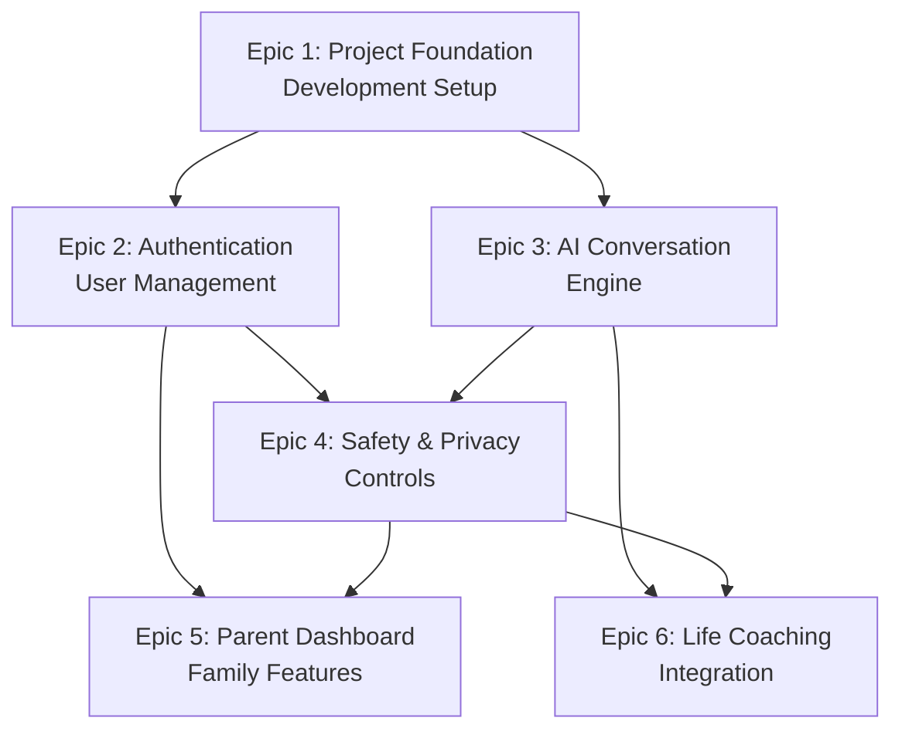

# Amicly Development Epics

This directory contains the complete epic breakdown for the Amicly AI Life Companion for Teenagers project. Each epic builds upon previous ones to create a comprehensive, safety-first AI companion system.

## Epic Overview & Dependencies

## Development Sequence

### Phase 1: Foundation (Epics 1-2)
**Timeline:** 3-4 weeks
- **Epic 1:** Project Foundation & Development Setup
- **Epic 2:** Authentication & User Management

**Outcome:** Developers can build and deploy, teens and parents can register and authenticate

### Phase 2: Core AI Experience (Epic 3)
**Timeline:** 3-4 weeks
- **Epic 3:** AI Conversation Engine

**Outcome:** Teens can have natural conversations with AI companion via text and voice

### Phase 3: Safety & Family Integration (Epics 4-5)
**Timeline:** 4-5 weeks
- **Epic 4:** Safety & Privacy Controls
- **Epic 5:** Parent Dashboard & Family Features

**Outcome:** Complete safety monitoring, crisis detection, and family-friendly features

### Phase 4: Market Differentiation (Epic 6)
**Timeline:** 3-4 weeks
- **Epic 6:** Life Coaching Integration

**Outcome:** AI Life Coach capabilities that differentiate from entertainment-focused competitors

## Epic Details

| Epic | Focus | Stories | Key Requirements | Critical Dependencies |
|------|-------|---------|-----------------|----------------------|
| [Epic 1](epic-1-project-foundation.md) | Development Setup | 4 | AWS infrastructure, mobile app foundation | ReferenceApp-Expo access, AWS account |
| [Epic 2](epic-2-authentication-user-management.md) | User Authentication | 4 | COPPA compliance, family linking | Epic 1 complete |
| [Epic 3](epic-3-ai-conversation-engine.md) | AI Conversations | 4 | <3s response time, voice processing | Epics 1-2, AWS Bedrock access |
| [Epic 4](epic-4-safety-privacy-controls.md) | Safety & Privacy | 4 | 99.5% safety compliance, crisis detection | Epics 2-3 complete |
| [Epic 5](epic-5-parent-dashboard-family-features.md) | Parent Dashboard | 4 | Web dashboard, privacy-respecting insights | Epics 2,4 complete |
| [Epic 6](epic-6-life-coaching-integration.md) | Life Coaching | 4 | Natural coaching integration, skill development | Epics 3-4 complete |

## MVP Definition

**Minimum Viable Product includes:**
- Epic 1: Complete development environment
- Epic 2: Secure teen and parent authentication
- Epic 3: Core AI conversation capabilities (text + voice)
- Epic 4: Essential safety monitoring and privacy controls
- Epic 5: Basic parent dashboard with teen-controlled sharing

**Post-MVP Enhancement:**
- Epic 6: Advanced life coaching integration
- Additional AI conversation features
- Enhanced parent dashboard analytics
- Advanced safety and privacy features

## Project Type: Greenfield Extension

**Foundation:** Extends existing ReferenceApp-Expo React Native application
- **Preserves:** Six-theme design system (3 light + 3 dark variations), #FF4D67 primary colors, Urbanist typography (Regular, Medium, SemiBold, Bold), Z-components (ZText, ZButton, ZHeader)
- **Extends:** Adds AI conversation capabilities and AWS backend services while maintaining theme switching and live preview functionality
- **Maintains:** Existing mobile app patterns, theme architecture, and user experience including Storybook integration

## Critical Success Factors

1. **Safety First:** Every feature must prioritize teen safety and appropriate development
2. **Privacy Respect:** Teen autonomy and privacy controls are non-negotiable
3. **Family Trust:** Strengthen rather than strain family relationships
4. **Natural AI:** Conversations feel helpful and genuine, not artificial
5. **Performance:** Meet strict response time requirements for user engagement

## Next Steps

1. **Immediate:** Execute Epic 1 to establish development foundation
2. **Development Team:** Begin story breakdown for Epic 1 implementation
3. **Product Team:** Validate epic sequence and story priorities
4. **Stakeholders:** Review epic scope and timeline estimates

---

*This epic structure addresses the critical blocking issues identified in the Product Owner checklist and provides a clear path from greenfield development to market-ready AI Life Companion.*